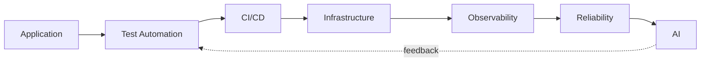
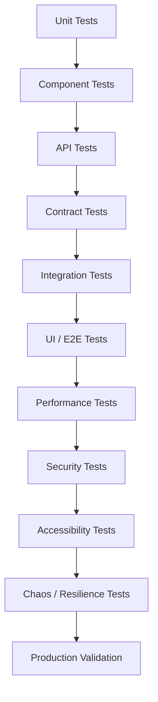
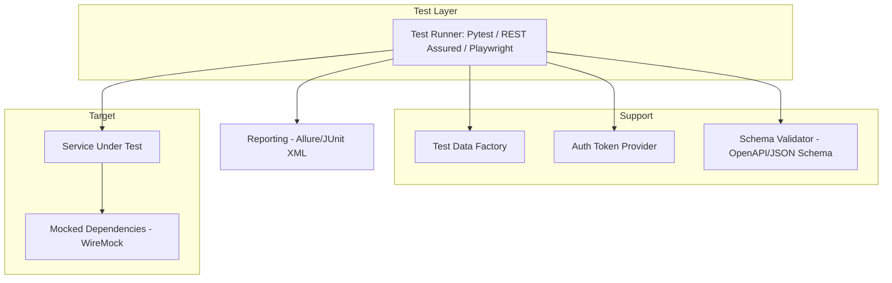
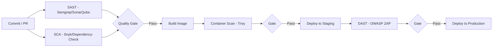
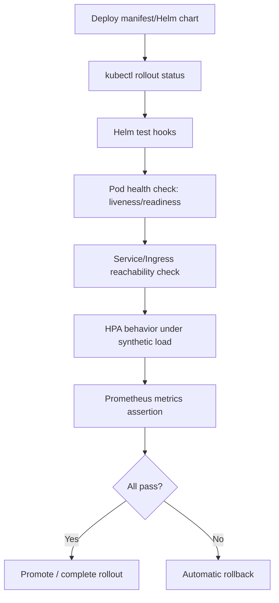
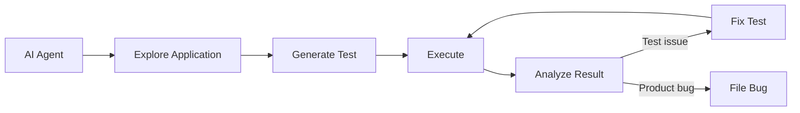
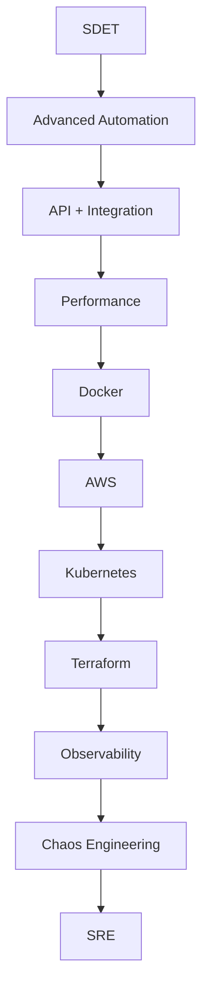
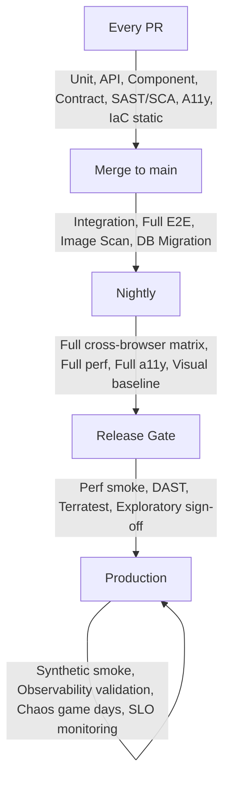

# Test Automation Tools & Technology Landscape

**A Comprehensive Reference for the Modern Test Automation Ecosystem**

**Type**: Master Reference Guide
**Difficulty**: ⭐⭐⭐ (Intermediate–Advanced)
**Domain**: Test Automation Tooling Landscape
**Audience**: SDETs, QA Engineers, Automation Engineers, Test Automation Architects, SREs, DevOps Engineers, Engineering Managers, developers new to testing, and engineers planning an SDET → SRE transition
**Created**: 2026-08-23

<a class="topic-crosslink" href="/cheatsheets/test-automation-tooling-landscape">📋 Quick reference: Tooling Landscape →</a>

---

<div class="mental-model">
<span class="mental-model__label">🧭 Mental model</span>

<svg viewBox="0 0 780 300" role="img" aria-labelledby="mm-landscape-title mm-landscape-desc">
<title id="mm-landscape-title">The ecosystem as a feedback loop from application to AI and back</title>
<desc id="mm-landscape-desc">Application code flows through test automation, CI/CD, and infrastructure into observability and reliability, and AI-assisted generation and failure analysis feed back into test automation, closing the loop rather than ending it.</desc>
<defs>
  <marker id="mm-landscape-arrow" viewBox="0 0 10 10" refX="8.5" refY="5" markerWidth="7" markerHeight="7" orient="auto-start-reverse">
    <path d="M0,0 L10,5 L0,10 z" class="mm-arrowhead"/>
  </marker>
</defs>

<rect class="mm-n5" x="10" y="30" width="170" height="55" rx="10"/>
<text class="mm-node-title" x="95" y="53" text-anchor="middle">Application</text>
<text class="mm-node-sub" x="95" y="69" text-anchor="middle">the system under test</text>

<path class="mm-arrow" d="M180,57 L195,57" marker-end="url(#mm-landscape-arrow)"/>

<rect class="mm-n1" x="200" y="30" width="170" height="55" rx="10"/>
<text class="mm-node-title" x="285" y="53" text-anchor="middle">Test Automation</text>
<text class="mm-node-sub" x="285" y="69" text-anchor="middle">unit → API → E2E → chaos</text>

<path class="mm-arrow" d="M370,57 L385,57" marker-end="url(#mm-landscape-arrow)"/>

<rect class="mm-n2" x="390" y="30" width="170" height="55" rx="10"/>
<text class="mm-node-title" x="475" y="53" text-anchor="middle">CI/CD</text>
<text class="mm-node-sub" x="475" y="69" text-anchor="middle">gates every change</text>

<path class="mm-arrow" d="M560,57 L575,57" marker-end="url(#mm-landscape-arrow)"/>

<rect class="mm-n3" x="580" y="30" width="170" height="55" rx="10"/>
<text class="mm-node-title" x="665" y="53" text-anchor="middle">Infrastructure</text>
<text class="mm-node-sub" x="665" y="69" text-anchor="middle">IaC, Kubernetes, cloud</text>

<path class="mm-arrow" d="M665,85 L665,200" marker-end="url(#mm-landscape-arrow)"/>

<rect class="mm-n4" x="580" y="200" width="170" height="55" rx="10"/>
<text class="mm-node-title" x="665" y="223" text-anchor="middle">Observability</text>
<text class="mm-node-sub" x="665" y="239" text-anchor="middle">traces, metrics, logs</text>

<path class="mm-arrow" d="M580,227 L565,227" marker-end="url(#mm-landscape-arrow)"/>

<rect class="mm-n6" x="390" y="200" width="170" height="55" rx="10"/>
<text class="mm-node-title" x="475" y="223" text-anchor="middle">Reliability</text>
<text class="mm-node-sub" x="475" y="239" text-anchor="middle">SLOs, error budgets, SRE</text>

<path class="mm-arrow" d="M390,227 L375,227" marker-end="url(#mm-landscape-arrow)"/>

<rect class="mm-n5" x="200" y="200" width="170" height="55" rx="10"/>
<text class="mm-node-title" x="285" y="223" text-anchor="middle">AI</text>
<text class="mm-node-sub" x="285" y="239" text-anchor="middle">generation, triage, root cause</text>

<path class="mm-arrow" d="M285,200 L285,90" stroke-dasharray="4,3" marker-end="url(#mm-landscape-arrow)"/>
<text class="mm-flow-label" x="330" y="145" text-anchor="middle">feedback:</text>
<text class="mm-flow-label" x="330" y="158" text-anchor="middle">AI feeds back into automation</text>
</svg>

<p class="mental-model__caption">Reading the ecosystem as a feedback loop, not a line: application code flows through test automation, CI/CD, and infrastructure into observability and reliability — and AI-assisted generation and failure analysis loop back into test automation, continuously improving the layer the loop started from.</p>
</div>

## Executive Summary

Test automation stopped being "write Selenium scripts against the UI" a long time ago. Today it spans unit tests, contract tests, API automation, mobile automation, performance and chaos engineering, security scanning, infrastructure validation, Kubernetes testing, observability-driven assertions, and — increasingly — AI-assisted test generation and failure analysis. The tools in each category solve different problems, at different layers, at different costs, and picking the right one is a function of your architecture, your team's skills, and what you're actually trying to prove.

This guide does not rank tools by popularity or declare a single "best" stack. It explains **what each category of tooling solves, when to reach for it, how comparable tools differ, how the pieces fit together into a coherent strategy, and how to sequence your own learning** — whether you're a beginner QA engineer, a Principal SDET, or an SDET moving toward an SRE role. Acronyms are defined on first use; tools are labeled mature or emerging where that distinction matters; and every comparison includes trade-offs rather than a verdict, because in this space "it depends" is usually the technically correct answer.

---

## Table of Contents

1. [Introduction](#1-introduction)
2. [Test Automation Pyramid](#2-test-automation-pyramid)
3. [Web UI / E2E Automation](#3-web-ui--e2e-automation)
4. [Mobile Test Automation](#4-mobile-test-automation)
5. [API and Backend Automation](#5-api-and-backend-automation)
6. [Unit Testing Frameworks](#6-unit-testing-frameworks)
7. [Integration, Component and Contract Testing](#7-integration-component-and-contract-testing)
8. [Performance and Load Testing](#8-performance-and-load-testing)
9. [Visual Regression Testing](#9-visual-regression-testing)
10. [Accessibility Testing](#10-accessibility-testing)
11. [Security Testing](#11-security-testing)
12. [Database and Data Testing](#12-database-and-data-testing)
13. [Distributed Systems and Messaging Testing](#13-distributed-systems-and-messaging-testing)
14. [Chaos and Resilience Testing](#14-chaos-and-resilience-testing)
15. [CI/CD Test Automation](#15-cicd-test-automation)
16. [Cloud and Infrastructure Testing](#16-cloud-and-infrastructure-testing)
17. [Kubernetes Testing](#17-kubernetes-testing)
18. [Observability-Driven Testing](#18-observability-driven-testing)
19. [Test Reporting and Test Management](#19-test-reporting-and-test-management)
20. [AI-Powered Test Automation](#20-ai-powered-test-automation)
21. [Test Automation Architecture](#21-test-automation-architecture)
22. [Recommended Technology Stack by Career Level](#22-recommended-technology-stack-by-career-level)
23. [Recommended Modern SDET Stack](#23-recommended-modern-sdet-stack)
24. [SDET → SRE Test Automation Stack](#24-sdet--sre-test-automation-stack)
25. [Tool Selection Framework](#25-tool-selection-framework)
26. [Open Source vs Commercial Tools](#26-open-source-vs-commercial-tools)
27. [Common Test Automation Mistakes](#27-common-test-automation-mistakes)
28. [Building a Test Automation Platform](#28-building-a-test-automation-platform)
29. [Example Enterprise Test Strategy](#29-example-enterprise-test-strategy)
30. [Final Reference Guide](#30-final-reference-guide)

---

## 1. Introduction

### What test automation means today

Test automation used to mean one thing: a script that clicks through a browser so a human doesn't have to. That definition is now a small subset of the discipline. Modern test automation is **the practice of using code, tooling, and infrastructure to verify that a system behaves correctly, performs acceptably, remains secure, stays accessible, and recovers from failure — continuously, at every layer of the stack, from a single function up through a live production environment.**

That expansion happened because software architecture changed. A monolith with a server-rendered UI could be reasonably well covered by UI automation plus some unit tests. A system built from dozens of services, async messaging, third-party APIs, container orchestration, and infrastructure-as-code cannot be — there is no browser click that exercises a Kafka consumer's retry logic or a Terraform module's security posture. Automation had to move to where the risk actually lives.

### How test automation has evolved

| Era | Primary Focus | Representative Tools | Limitation |
|---|---|---|---|
| **Record & playback** (1990s–2000s) | UI scripts recorded from manual clicks | WinRunner, QTP | Brittle, non-code, unmaintainable at scale |
| **Code-driven UI automation** (2000s–2010s) | Selenium WebDriver, page objects | Selenium, Watir | Flaky waits, slow, UI-heavy pyramids |
| **Full-stack SDET era** (2010s–2020s) | API, unit, and UI automation combined; CI/CD integration | REST Assured, Jest, Cypress, Postman | Still largely pre-production, correctness-only |
| **Engineering-driven quality** (2020s–present) | Contract testing, chaos engineering, observability, IaC validation, AI-assisted testing | Playwright, Testcontainers, k6, OpenTelemetry, LitmusChaos, Copilot/Claude Code | Requires broader skill set across the stack |

### Traditional automation vs modern engineering-focused testing

Traditional automation asked: *does clicking this button produce the expected screen?* Modern testing asks a wider set of questions across the whole delivery lifecycle: *does the API contract still hold for every consumer? Does the system stay within its SLO under load? Does it recover when a dependency fails? Does the Terraform plan introduce an open security group? Do the traces and error rates after deploy look like the traces and error rates before it?*

The shift is from **testing the application** to **testing the system** — application code, infrastructure, delivery pipeline, and runtime behavior together. This is why the discipline increasingly overlaps with DevOps and Site Reliability Engineering (SRE).

### Why automation is moving beyond UI testing

Three forces are driving this:

1. **Architectural complexity** — microservices, event-driven systems, and third-party integrations create failure modes a UI test cannot see or reproduce reliably.
2. **Delivery speed** — teams deploying multiple times a day cannot rely on a slow, flaky UI suite as their primary safety net; fast feedback has to come from lower, cheaper layers.
3. **Production reality** — a system that passes every pre-production test can still fail in production due to scale, real traffic patterns, or infrastructure drift, which is why performance, chaos, and observability-driven checks now extend testing *into* production.

### QA, SDET, Test Automation, DevOps, SRE, Quality Engineering, and Platform Engineering

These roles overlap heavily and the boundaries are organizational, not technical:

- **QA (Quality Assurance)** — historically owns manual test execution, test planning, and release sign-off. Increasingly QA engineers also write automation.
- **SDET (Software Development Engineer in Test)** — a software engineer whose product is test automation, frameworks, and tooling rather than end-user features.
- **Test Automation** — the practice/discipline (not a role) of encoding verification as executable code.
- **Quality Engineering (QE)** — a broader framing that treats quality as a property the whole team owns, not a phase or a handoff; SDETs typically sit inside QE.
- **DevOps** — the practice of unifying development and operations, with CI/CD, infrastructure automation, and deployment reliability as its core concerns; test automation is one of its inputs.
- **SRE (Site Reliability Engineer)** — applies software engineering to operations: SLOs, error budgets, incident response, capacity planning. SRE consumes the same telemetry and much of the same tooling (load testing, chaos engineering, observability) that modern test automation produces.
- **Platform Engineering** — builds the internal tooling and self-service infrastructure (CI/CD platforms, environments, test infrastructure) that SDETs, developers, and SREs all build on top of.

A useful mental model: **QA/SDET/QE own "does it work and hold up"; DevOps owns "can we ship it safely and often"; SRE owns "does it stay up and recover when it doesn't"; Platform Engineering owns "what do all of the above run on."** Modern automation sits at the intersection of all four, which is exactly why SDET → SRE is now a common, well-trodden career transition (see [Section 24](#24-sdet--sre-test-automation-stack)).

### What a modern automation ecosystem looks like



Each arrow is a feedback loop, not a one-way pipeline: observability data feeds back into what gets tested next (see [Section 18](#18-observability-driven-testing)), and AI increasingly closes the loop by generating and prioritizing tests from production signal (see [Section 20](#20-ai-powered-test-automation)).

---

## 2. Test Automation Pyramid

### The traditional pyramid

```text
              E2E Tests
           /-------------\
        Integration Tests
      /---------------------\
          API Tests
    /-------------------------\
           Unit Tests
```

The pyramid is a **cost and stability model**, not a literal build order: fewer tests belong at the top because top-layer tests (end-to-end, or E2E) are slow, expensive to write, and more prone to flakiness (intermittent, non-deterministic failures unrelated to a real bug); more tests belong at the bottom because unit tests are fast, cheap, and deterministic. The shape describes *proportion of test count*, not *order of priority* — a team should still write E2E tests, just far fewer of them than unit tests.

### The modern, expanded pyramid

Modern systems need more categories than the classic four layers describe:



| Layer | Purpose | Speed | Cost | Stability | Maintenance | Typical Owner |
|---|---|---|---|---|---|---|
| **Unit** | Verify a single function/class in isolation | Very fast (ms) | Very low | Very high | Low | Developer |
| **Component** | Verify a UI component or module in isolation, with real rendering | Fast | Low | High | Low–Medium | Developer / SDET |
| **API** | Verify service behavior via its HTTP/GraphQL/RPC contract | Fast | Low | High | Medium | SDET |
| **Contract** | Verify producer/consumer expectations stay compatible | Fast | Low–Medium | High | Medium | SDET |
| **Integration** | Verify multiple real components work together (DB, queue, service) | Medium | Medium | Medium–High | Medium | SDET |
| **UI/E2E** | Verify a full user journey through a real browser/app | Slow | High | Medium (flakiness risk) | High | SDET / QA |
| **Performance** | Verify latency, throughput, and capacity under load | Slow (dedicated runs) | Medium–High | Medium | Medium | SDET / SRE |
| **Security** | Verify the system resists known attack classes | Medium–Slow | Medium | High | Low–Medium | SDET / AppSec |
| **Accessibility** | Verify the UI is usable with assistive technology | Fast | Low | High | Low | SDET / Frontend |
| **Chaos/Resilience** | Verify the system degrades gracefully under real failure | Slow, scheduled | High | Low (by design — injects real faults) | High | SRE / SDET |
| **Production Validation** | Verify the live system post-deploy (smoke tests, synthetic checks, observability assertions) | Fast–Continuous | Low–Medium | High | Low–Medium | SRE / DevOps |

**Where each belongs**: unit and component tests run on every save/commit; API, contract, and integration tests run on every pull request (PR); UI/E2E and security run on every PR or pre-merge gate; performance and accessibility run on a schedule or pre-release gate; chaos and production validation run post-deploy or on a recurring schedule against staging/production. See [Section 29](#29-example-enterprise-test-strategy) for a concrete cadence.

The core discipline the pyramid teaches hasn't changed even as the layers multiplied: **push each verification down to the cheapest layer that can actually catch the bug.** A missing null check belongs in a unit test, not an E2E click-through; a broken producer/consumer assumption belongs in a contract test, not a full integration environment.

---

## 3. Web UI / E2E Automation

Web UI/end-to-end (E2E) automation drives a real (or real-enough) browser through the same interactions a user would perform and asserts on the resulting state. It sits at the top of the pyramid: closest to what a user experiences, most expensive to write and maintain, and most valuable as final proof a release works.

### Tool-by-tool overview

**Playwright** (Microsoft, mature) — a Node.js-originated, multi-language (TypeScript/JavaScript, Python, Java, .NET) browser automation library with native support for Chromium, Firefox, and WebKit. Architecture: talks to browsers over the CDP-like internal protocol, not a WebDriver proxy, which enables built-in auto-waiting (it waits for an element to be actionable before interacting, eliminating most manual `sleep`/explicit-wait code), built-in parallel execution and test sharding, a trace viewer for post-failure debugging, and network interception for mocking. Strong mobile web emulation; can also drive Android Chrome and iOS Safari via experimental support. No native API testing tool historically, but ships `APIRequestContext` for HTTP calls in the same test. Reporting via built-in HTML reporter or third-party (Allure). CI/CD integration is first-class (official GitHub Actions, Docker images). **Strengths**: speed, reliability, debugging tools, one API across browsers. **Weaknesses**: newer ecosystem than Selenium's, smaller enterprise-grid tooling footprint (though growing). **Best for**: new projects, teams wanting cross-browser coverage without WebDriver overhead. **Avoid when**: the team is fully invested in a legacy Selenium Grid enterprise setup with no driver to migrate. Docs: https://playwright.dev

**Selenium** (mature, ~2004) — the original cross-language (Java, Python, JavaScript, C#, Ruby, Kotlin) browser automation standard, built on the W3C WebDriver protocol. Architecture: a client library talks to a browser-specific driver (ChromeDriver, GeckoDriver) over HTTP. Broadest browser and grid ecosystem (Selenium Grid, BrowserStack, Sauce Labs, LambdaTest all support it natively). No built-in auto-waiting — explicit/implicit waits must be coded, which is the single largest source of historical "flaky Selenium test" complaints. No native API or mobile support (Appium, covered in [Section 4](#4-mobile-test-automation), reuses the WebDriver protocol). **Strengths**: unmatched language and grid breadth, huge community, enterprise support (Selenium Grid + commercial clouds). **Weaknesses**: verbose, wait-handling burden on the author, slower iteration than Playwright/Cypress. **Best for**: legacy suites, non-JS enterprise stacks, environments requiring specific grid/vendor integrations. **Avoid when**: starting a greenfield project with no legacy constraint — Playwright covers the same ground with less flakiness-prone code. Docs: https://www.selenium.dev

**Cypress** (mature) — a JavaScript/TypeScript-only, developer-experience-focused E2E and component testing tool. Architecture: runs inside the browser itself (not out-of-process like Selenium/Playwright), which gives excellent debugging (time-travel snapshots, real-time reload) but historically limited it to Chromium-family browsers plus Firefox and Edge (WebKit/Safari is not supported natively). No true multi-tab or multi-origin support in the classic API (multi-origin support has since been added but with constraints). **Strengths**: best-in-class developer experience and debugging UI, strong component-testing story, large plugin ecosystem. **Weaknesses**: JS/TS only, no Safari/WebKit, architecture makes certain cross-origin scenarios awkward. **Best for**: frontend-heavy JS/TS teams that want fast local iteration and don't need WebKit coverage. **Avoid when**: Safari/WebKit coverage is a hard requirement, or the team needs non-JS language support. Docs: https://docs.cypress.io

**WebdriverIO** (mature) — a Node.js WebDriver (and Chrome DevTools Protocol) automation framework supporting both web and mobile (via Appium integration) from one framework. Architecture: pluggable protocol layer (WebDriver or CDP), extensive service/plugin ecosystem (Sauce Labs, BrowserStack, Allure, Cucumber). **Strengths**: one framework for web + mobile, strong plugin architecture, good for teams wanting behavior-driven development (BDD) support. **Weaknesses**: more configuration overhead than Playwright/Cypress out of the box. **Best for**: teams needing a single tool across web and mobile with WebDriver-protocol flexibility. Docs: https://webdriver.io

**Puppeteer** (mature) — Google's Node.js library for Chrome/Chromium (and limited Firefox) automation over CDP. Lighter-weight than Playwright, no multi-browser abstraction. **Best for**: Chrome-only automation, PDF generation, scraping, performance auditing. **Avoid when**: cross-browser coverage is needed — Playwright is effectively Puppeteer's successor with multi-browser support from the same original team. Docs: https://pptr.dev

**TestCafe** (mature) — JS/TS, driver-less (injects a proxy script, no WebDriver) cross-browser tool. Simpler setup than Selenium, no external driver management. **Best for**: small-to-mid JS teams wanting simplicity. **Weaknesses**: smaller ecosystem and slower innovation pace than Playwright/Cypress. Docs: https://testcafe.io

**Nightwatch.js** (mature) — JS/TS, WebDriver-based, includes built-in test runner and assertion library. **Best for**: teams wanting an all-in-one Selenium-based JS framework without assembling pieces separately.

**Robot Framework** (mature) — Python-ecosystem, keyword-driven automation framework (not JS/TS-based); tests are written in a tabular, largely natural-language syntax with keywords backed by Python/Java libraries (including Selenium/Playwright libraries). **Strengths**: readable by non-engineers (manual QA, business stakeholders can read/author tests), huge library ecosystem beyond web (API, mobile, desktop). **Weaknesses**: keyword syntax is less expressive than full code for complex logic. **Best for**: teams with mixed technical/non-technical test authors, or needing one framework across web, API, and desktop. Docs: https://robotframework.org

**CodeceptJS** (mature, smaller community) — JS/TS, high-level abstraction layer that can run on top of Playwright, Puppeteer, or WebDriver as its backend. **Best for**: teams wanting BDD-style readable tests decoupled from the underlying driver.

**Taiko** (emerging/lower activity) — JS browser automation from ThoughtWorks with a natural-language-like API. Smaller community than the above; evaluate current maintenance activity before adopting.

**Watir** (mature, niche) — Ruby-based WebDriver wrapper. Relevant almost exclusively for teams already standardized on Ruby.

### Comparison table

| Tool | Languages | Browsers | Parallel Exec | Mobile Web | API Support | Debugging | Best Use Case |
|---|---|---|---|---|---|---|---|
| **Playwright** | TS/JS, Python, Java, .NET | Chromium, Firefox, WebKit | Native, built-in sharding | Emulation + experimental native | Built-in `APIRequestContext` | Trace viewer, video, screenshots | New projects, cross-browser E2E |
| **Selenium** | Java, Python, JS, C#, Ruby, Kotlin | All major (via drivers) | Via Grid/cloud vendors | Via Appium | None native | Screenshots, driver logs | Legacy/enterprise, non-JS stacks |
| **Cypress** | JS/TS | Chromium-family, Firefox, Edge (no WebKit) | Via Cypress Cloud/CI matrix | Limited | `cy.request()` | Best-in-class time-travel debugger | JS/TS frontend teams |
| **WebdriverIO** | JS/TS | All major (WebDriver/CDP) | Via services | Via Appium (same framework) | Via plugins | Good, service-based | Unified web + mobile |

### Playwright vs Selenium vs Cypress vs WebdriverIO

| Criterion | Playwright | Selenium | Cypress | WebdriverIO |
|---|---|---|---|---|
| **Auto-waiting** | Yes, built-in | No — manual waits | Yes, built-in | Partial (via `waitFor`) |
| **Cross-browser (real WebKit/Safari)** | Yes | Yes (via drivers) | No | Yes |
| **Architecture** | Out-of-process, custom protocol | Out-of-process, WebDriver | In-browser | Out-of-process, WebDriver/CDP |
| **Language breadth** | High | Highest | JS/TS only | JS/TS-centric |
| **Mobile (native app) support** | No (web only) | Via Appium | No | Via Appium (same framework) |
| **Learning curve** | Low–Medium | Medium | Low | Medium |
| **Enterprise grid ecosystem** | Growing | Largest (mature) | Smaller | Via services |
| **When to pick it** | Greenfield, cross-browser, fast CI | Legacy, non-JS, existing Grid investment | JS-only teams prioritizing DX, no WebKit need | Need one tool spanning web + mobile |

None of these four is universally "better" — a team standardized on Java with an existing Selenium Grid investment and enterprise support contracts has a real cost to migrating even though Playwright's flakiness profile is better; a team starting fresh with no legacy constraint has little reason to choose Selenium over Playwright today.

---

## 4. Mobile Test Automation

Mobile automation splits along two axes: **platform** (Android vs iOS) and **app type** (native, hybrid, or cross-platform framework like React Native/Flutter).

### Tool-by-tool overview

**Appium** (mature) — the dominant cross-platform mobile automation tool. Architecture: extends the WebDriver protocol to mobile, driving native, hybrid, and mobile-web apps on both Android and iOS through platform-specific drivers (UiAutomator2 for Android, XCUITest for iOS under the hood). Language-agnostic client libraries (Java, Python, JS, Ruby, C#). **Strengths**: one API across Android and iOS, works with real devices, emulators/simulators, and device farms (BrowserStack App Automate, Sauce Labs, AWS Device Farm). **Weaknesses**: slower than native frameworks since it proxies through platform drivers; setup/environment complexity (SDKs, drivers, capabilities) is a common early adoption cost. **Best for**: teams needing one automation layer across Android + iOS, or testing hybrid/React Native/Flutter apps without separate native suites. Docs: https://appium.io

**Espresso** (mature, Google) — native Android UI testing framework, Kotlin/Java, runs in-process with the app, extremely fast and stable because it synchronizes automatically with the app's UI thread. **Best for**: Android-only teams wanting the fastest, most reliable native test layer. **Weakness**: Android-only, no cross-platform reuse.

**XCUITest** (mature, Apple) — native iOS UI testing framework built into Xcode, Swift/Objective-C. Runs in-process, fast, reliable, tightly integrated with Xcode tooling and simulators. **Best for**: iOS-only teams. **Weakness**: iOS-only.

**Maestro** (emerging but rapidly maturing) — a newer mobile UI testing tool built for simplicity: YAML-based test flows (not code), built-in auto-waiting/retries tuned for mobile's inherent flakiness (animations, network variance), works across Android, iOS, and React Native/Flutter with one syntax. **Strengths**: dramatically lower setup friction than Appium, resilient by default to timing issues. **Weaknesses**: less flexible than full code-based frameworks for complex custom logic; younger ecosystem, smaller enterprise tooling footprint. **Best for**: teams wanting fast mobile E2E coverage without Appium's setup overhead. **Avoid when**: you need deep custom native interaction logic beyond what the YAML flow syntax supports. Docs: https://maestro.mobile.dev

**Detox** (mature within its niche) — a React Native-focused end-to-end testing framework (Wix), gray-box tested (synchronizes with the app's async operations, similar in spirit to Espresso's synchronization, reducing flakiness). **Best for**: React Native apps specifically. **Weakness**: not a general-purpose tool outside React Native.

**Flutter integration testing** (`integration_test` package, mature within Flutter) — Google-provided, runs Flutter widget/integration tests on real devices/emulators using the Flutter test framework itself. **Best for**: Flutter-only teams wanting first-party tooling.

**UIAutomator / UIAutomator2** (mature) — the underlying Android instrumentation framework that Appium's Android driver builds on; can also be used directly for lower-level Android UI automation.

**EarlGrey** (mature, narrower adoption) — Google's native iOS UI testing framework (predates and overlaps with XCUITest); less commonly chosen for new projects today given XCUITest's first-party Xcode integration.

### Device and environment strategy

| Approach | Speed | Fidelity | Cost | Best For |
|---|---|---|---|---|
| **Emulator/Simulator** | Fast | Medium (no real hardware quirks) | Low (free, local/CI) | Fast feedback in CI, most functional testing |
| **Real device (local lab)** | Medium | High | Medium–High (hardware, maintenance) | Hardware-dependent features (camera, biometrics, sensors) |
| **Device farm (cloud)** | Medium | High | Pay-per-use, scales | Cross-device/OS-version coverage without owning hardware |

### Appium vs Maestro vs native frameworks

| Criterion | Appium | Maestro | Espresso/XCUITest |
|---|---|---|---|
| **Cross-platform (one test, both OSes)** | Yes | Yes | No |
| **Test authoring** | Code (Java/Python/JS/etc.) | YAML flows | Native code (Kotlin/Swift) |
| **Setup complexity** | High | Low | Medium (native toolchain, but first-party) |
| **Speed** | Slower (protocol proxy) | Medium | Fastest (in-process) |
| **Flakiness handling** | Manual waits, capability tuning | Built-in, mobile-tuned | Built-in (native sync) |
| **Best for** | Broad cross-platform coverage, hybrid/RN/Flutter apps | Fast setup, YAML-friendly teams, RN/Flutter | Platform-specific teams wanting max speed/stability |
| **Maturity** | Mature, large ecosystem | Emerging, growing fast | Mature |

A common, defensible pattern: use **Espresso/XCUITest** for platform teams that own native code directly and want the fastest unit-adjacent UI checks, and **Appium or Maestro** for cross-platform E2E journeys that need to run identically (or near-identically) on both OSes. Maestro is worth evaluating over Appium for new mobile E2E work specifically because of its lower setup cost and mobile-tuned reliability — but its smaller ecosystem and device-farm integration maturity are real trade-offs to weigh against an existing Appium investment.

---

## 5. API and Backend Automation

API testing verifies a service's behavior at its contract boundary (HTTP, GraphQL, gRPC, SOAP) without paying the cost of rendering a UI. It sits below UI/E2E in the pyramid because it's faster, more stable, and closer to the actual business logic being validated.

### Tool-by-tool overview

**Postman** (mature) — the dominant GUI-first API client and test tool; supports scripted pre-request/test assertions in JavaScript, collection-based organization, environment variables, and mock servers. **Best for**: exploratory API testing, collaborative API design/documentation, teams wanting a low-code entry point. **Weakness**: GUI-first workflow is harder to version-control and code-review cleanly than a code-based suite, though collections can be exported as JSON. Docs: https://learning.postman.com

**Newman** (mature) — Postman's CLI runner, turning Postman collections into CI/CD-executable suites. Bridges Postman's GUI authoring with pipeline automation.

**REST Assured** (mature) — a Java DSL (domain-specific language) for testing REST APIs with fluent, readable assertions (`given().when().then()`). **Best for**: Java-centric teams, especially where the application under test is also Java (shared tooling/CI). Docs: https://rest-assured.io

**Playwright APIRequest** (mature) — Playwright's built-in HTTP client (`request` fixture), enabling API tests in the same language/runner as UI tests, and API-driven setup/teardown for E2E tests (e.g., creating test data via API before a UI flow). **Best for**: teams already on Playwright wanting one tool for both UI and API layers.

**SuperTest** (mature) — a Node.js library for testing HTTP servers (commonly Express apps) directly in-process or over the wire; pairs naturally with Jest/Mocha. **Best for**: Node.js backend teams testing their own services.

**Pytest + Requests** (mature) — the standard Python combination: `pytest` as the test runner/assertion framework, `requests` (or `httpx` for async) as the HTTP client. **Best for**: Python-centric teams; highly flexible, no DSL to learn beyond Python itself.

**Karate** (mature) — a Java-based but effectively no-code/low-code framework using a Gherkin-like syntax purpose-built for API testing, with built-in JSON/XML schema validation, data-driven testing, and even performance testing (via Gatling integration) from the same syntax. **Strengths**: extremely fast to write tests without deep Java knowledge; strong for consumer contract-style JSON assertions. **Best for**: teams wanting BDD-readable API tests without hand-rolling assertions. Docs: https://karatelabs.github.io/karate

**SoapUI** (mature, legacy-leaning) — GUI-based tool historically strong for SOAP web services testing, also supports REST. **Best for**: organizations still maintaining SOAP-based enterprise services. **Weakness**: dated workflow compared to code-first tools for REST/GraphQL-first stacks.

**k6** (mature — covered in depth in [Section 8](#8-performance-and-load-testing)) — while primarily a load-testing tool, its JavaScript scripting model is also used for functional API checks embedded in performance scripts.

**Insomnia** (mature) — a Postman alternative with a similar GUI-first workflow, plugin system, and GraphQL-specific tooling; a matter of team preference more than a functional differentiator versus Postman for most use cases.

**Pact** (mature — covered in depth in [Section 7](#7-integration-component-and-contract-testing)) — the leading consumer-driven contract testing tool; distinct from functional API testing in that it verifies *compatibility between services* rather than correctness of a single service in isolation.

### What API automation must cover

- **Protocols**: REST (JSON/HTTP verbs), GraphQL (single-endpoint, query/mutation-based — requires schema-aware assertions, not just status-code checks), SOAP (XML/WSDL-based, still common in enterprise/financial/legacy systems), and increasingly gRPC for internal service-to-service calls.
- **Authentication & authorization**: verifying token issuance/expiry (OAuth2, JWT), verifying access is correctly denied for unauthorized roles/scopes — not just that authorized access succeeds. Authorization testing (can user A see user B's data?) is one of the most commonly under-tested areas in API suites.
- **Schema validation**: asserting the response body matches an expected JSON Schema/OpenAPI spec, not just spot-checking a few fields — catches breaking changes to fields the current test author didn't think to check.
- **Contract validation**: see [Section 7](#7-integration-component-and-contract-testing) — distinct from schema validation in that it verifies compatibility across service boundaries and versions, driven by actual consumer expectations.
- **Negative testing**: invalid inputs, missing required fields, wrong types, boundary values, rate-limit behavior, malformed auth tokens — the class of tests most often skipped under time pressure and most correlated with production incidents.
- **Data-driven testing**: running the same test logic across many input/output pairs (via parameterization) rather than duplicating test code per case.
- **API chaining**: using output from one call (an ID, a token) as input to a subsequent call — necessary for realistic multi-step workflows (create → update → verify → delete).
- **Mocking and service virtualization**: simulating a dependency's API when it's unavailable, slow, costly to call repeatedly, or not yet built — see [Section 7](#7-integration-component-and-contract-testing) for WireMock, MockServer, Hoverfly, and Mountebank.

### Example API automation architecture



A well-structured API suite separates **test data setup** (factories or fixtures, not hardcoded IDs), **auth handling** (a shared token provider, not re-authenticating per test), **schema/contract assertions** (spec-driven, not field-by-field guessing), and **execution/reporting** — this separation is what makes an API suite maintainable past a few dozen tests.

---

## 6. Unit Testing Frameworks

Unit tests verify a single function, method, or class in isolation from its dependencies (using stubs/mocks/fakes where needed). They are the foundation of the pyramid: fastest to run, cheapest to write, and the primary responsibility of the developer writing the code, not a separate QA/SDET function.

### JavaScript / TypeScript

| Framework | Notes |
|---|---|
| **Jest** (mature) | The dominant choice for React and general Node.js/TS projects; built-in mocking, snapshot testing, coverage reporting, zero-config for most setups. Docs: https://jestjs.io |
| **Vitest** (mature, fast-growing) | Vite-native, Jest-compatible API, significantly faster for Vite-based frontend projects due to native ESM and shared build tooling. Increasingly the default for new Vite/Vue/modern React projects. Docs: https://vitest.dev |
| **Mocha** (mature) | Flexible, unopinionated test runner — typically paired with Chai (assertions) and Sinon (mocks/spies) since it doesn't bundle them. |
| **Jasmine** (mature) | Batteries-included BDD-style framework, predates Jest; still used in Angular projects by default historically. |
| **AVA** (mature, niche) | Runs tests concurrently in separate processes by default; appeals to teams wanting strict test isolation. |
| **Node test runner** (`node:test`, mature as of recent Node LTS) | Built into Node.js itself — no dependency needed for basic unit testing; growing adoption for teams wanting to minimize dependencies. |

**When each makes sense**: Jest for most React/Node projects by default given ecosystem maturity; Vitest when the project is already Vite-based (near drop-in Jest API with better speed); Mocha when the team wants full control over assertion/mocking libraries; the built-in Node test runner for minimal-dependency projects or libraries.

### Python

| Framework | Notes |
|---|---|
| **Pytest** (mature, dominant) | Fixture-based dependency injection, powerful parameterization, huge plugin ecosystem (`pytest-mock`, `pytest-asyncio`, `pytest-cov`). The de facto standard for new Python projects, including API and integration testing (see [Section 5](#5-api-and-backend-automation)). |
| **unittest** (mature, standard library) | Built into Python, xUnit-style (`TestCase` classes). Verbose compared to Pytest but requires no dependency — relevant for constrained environments. |
| **Nose2** (maintenance mode) | Successor to the original Nose; largely superseded by Pytest for new projects. |

### Java

| Framework | Notes |
|---|---|
| **JUnit** (mature, dominant — JUnit 5/Jupiter) | The standard for Java unit testing; annotation-driven, extension model for custom behavior. |
| **TestNG** (mature) | Alternative to JUnit with built-in support for test groups, dependency ordering, and parallel execution configuration — often preferred for larger integration/API suites needing flexible execution control. |
| **Spock** (mature, Groovy-based) | Highly readable BDD-style specs (`given/when/then` blocks) for JVM projects; appeals to teams wanting more expressive test syntax than JUnit's annotations allow, at the cost of introducing Groovy. |

### .NET

| Framework | Notes |
|---|---|
| **NUnit** (mature) | Long-standing, feature-rich .NET testing framework, JUnit-inspired. |
| **xUnit** (mature, increasingly default) | Modern, more opinionated design (no `[SetUp]`/`[TearDown]` — uses constructor/`IDisposable` instead); Microsoft's own tooling favors it for new .NET projects. |
| **MSTest** (mature) | Microsoft's first-party framework, tightly integrated with Visual Studio; a reasonable default in shops standardized entirely on Microsoft tooling. |

**Ecosystem-level guidance**: pick the framework that matches the language your production code is already in — cross-language unit testing (e.g., testing a Java service's logic from a Python test) defeats the purpose of a unit test's tight feedback loop with the developer. Within an ecosystem, prefer the framework with the largest current community and plugin base unless a specific feature (Spock's readability, TestNG's execution control) justifies the deviation.

---

## 7. Integration, Component and Contract Testing

This layer sits between fast, isolated unit tests and slow, full-environment E2E tests. It answers a question neither extreme answers well: **do multiple real components actually work together correctly?**

### Definitions

- **Component testing** — testing a single module (often a UI component, but also a backend module) with its real internals but isolated from the rest of the system — deeper than a unit test, cheaper than a full integration test.
- **Integration testing** — testing multiple real collaborating parts together (a service plus its real database, or two services communicating), verifying the seams, not just each part in isolation.
- **Contract testing** — verifying that a consumer's expectations of a producer's API stay compatible, without needing both sides deployed together. **Consumer-driven contract testing** (Pact's model) has the consumer define the contract from its actual usage, which the producer then verifies against — catching breaking changes before they reach a shared environment, and without needing a slow, flaky, fully-deployed integration environment to catch them.
- **Service virtualization** — simulating a dependency's behavior (latency, specific responses, failure modes) so tests don't depend on that dependency being live, stable, or cheap to call repeatedly.

### Tool-by-tool overview

**Pact** (mature) — the leading consumer-driven contract testing framework. The consumer team writes tests against a mock of the producer, which generates a "pact" (a JSON contract file); the producer then replays that contract against its real implementation in CI, failing the build if it would break the consumer. Requires both sides to participate (or a broker in a shared org) — its value scales with the number of services and teams involved. **Best for**: microservice architectures with multiple teams/services where a breaking API change from one team can silently break another team's consumer. **Avoid when**: you have a single team owning both sides of every integration and can coordinate changes directly — the contract-testing overhead may not pay for itself yet. Docs: https://docs.pact.io

**WireMock** (mature) — an HTTP-level mock/stub server for simulating a dependency's API responses, including specific status codes, delays, and fault injection (connection resets, slow responses). **Best for**: isolating a service under test from a slow, flaky, or costly third-party API during integration testing.

**MockServer** (mature) — similar role to WireMock (HTTP mocking/verification), with strong support for both mocking and *verifying* that expected calls were made — useful when the test needs to assert your service called a dependency correctly, not just that it handled a canned response.

**Hoverfly** (mature, Go-based) — HTTP(S) proxy-based service virtualization; can operate in "capture" mode to record real traffic then replay it, useful for creating realistic virtualized dependencies from production-like traffic.

**Mountebank** (mature) — a cross-protocol service virtualization tool (HTTP, TCP, SMTP), useful when the dependency being virtualized isn't HTTP-based.

**Testcontainers** (mature, rapidly growing adoption) — a library (Java, Node.js, Python, Go, .NET, and more) that programmatically spins up real, disposable Docker containers (a real Postgres, a real Kafka broker, a real Redis) for the duration of a test run, then tears them down. This is fundamentally different from mocking: instead of simulating a database's behavior, the test runs against the *real* database engine. Docs: https://testcontainers.com

**LocalStack** (mature) — emulates AWS services (S3, SQS, SNS, DynamoDB, Lambda, and dozens more) locally, letting integration tests exercise AWS-dependent code without a real AWS account or costs. Fidelity varies by service — core services (S3, SQS, DynamoDB) are well-emulated; more complex or newer services have partial coverage, which is worth verifying before relying on it for a specific service.

**Spring Cloud Contract** (mature, Java/Spring ecosystem) — a contract-testing tool similar in spirit to Pact but native to the Spring ecosystem, generating stubs and verification tests from a shared contract definition (Groovy or YAML DSL).

### Why Testcontainers is becoming important for modern backend testing

Mocking a database or message broker means testing against your *assumptions* about how that system behaves — assumptions that quietly drift from reality (a SQL dialect quirk, a Kafka consumer-group rebalance edge case, an actual JSON serialization difference). Testcontainers closes that gap by running the *real* dependency, disposably, per test run: no shared test database to pollute, no environment drift between "works on my machine" and CI, and no long-lived test infrastructure to maintain. The trade-off is speed (starting a real container is slower than instantiating a mock) and CI resource cost (needs Docker-in-Docker or a Docker-capable runner) — which is exactly why it belongs at the *integration* layer of the pyramid, not the unit layer.

### Mocking vs Testcontainers vs full staging environment

| Approach | Fidelity | Speed | Cost | Best For |
|---|---|---|---|---|
| **Mocks (WireMock/MockServer)** | Low–Medium (simulated) | Fast | Low | Isolating from external/third-party APIs, simulating failure modes |
| **Testcontainers** | High (real engine) | Medium | Medium (CI compute) | Testing real interaction with owned infra (DB, queue, cache) |
| **Full staging environment** | Highest (production-like) | Slow | High (maintained env) | Final pre-release validation, cross-service E2E |

---

## 8. Performance and Load Testing

Performance testing answers questions unit, API, and E2E functional tests cannot: **does the system meet its latency and throughput targets, and where does it break, under realistic or extreme load?**

### Types of performance testing

| Type | Question Answered |
|---|---|
| **Load testing** | Does the system meet SLAs under expected/normal traffic? |
| **Stress testing** | What happens as load increases well beyond expected levels — where's the breaking point? |
| **Spike testing** | Can the system handle a sudden, sharp traffic increase (a flash sale, a viral post)? |
| **Soak testing** | Does the system remain stable under sustained load over a long duration (memory leaks, resource exhaustion, connection pool starvation)? |
| **Capacity testing** | How much load can current infrastructure handle before scaling is needed? |
| **Scalability testing** | Does adding resources (horizontal/vertical) actually improve throughput proportionally? |
| **Performance regression testing** | Has a recent code/infra change degraded performance versus a known baseline? |

### Tool-by-tool overview

**k6** (mature, Grafana Labs) — a developer-centric load testing tool with tests written in JavaScript, executed by a Go-based engine (so scripting is JS but execution is high-performance, unlike Node-based tools). Strong CI/CD integration, native cloud execution option, and tight integration with the Grafana/Prometheus observability stack. **Strengths**: code-as-test (version-controllable), fast execution engine, good for embedding in CI/CD as a pipeline gate. **Weaknesses**: less mature GUI/reporting than JMeter for non-engineers; protocol support is HTTP/WebSocket/gRPC-focused (less broad protocol coverage than JMeter). Docs: https://k6.io

**JMeter** (mature, Apache, long-standing) — GUI-first (though scriptable/CLI-capable) load testing tool with the broadest protocol support (HTTP, JDBC, JMS, SOAP, FTP, and more via plugins). **Strengths**: protocol breadth, huge plugin ecosystem, no-code test plan authoring for non-developers. **Weaknesses**: GUI-based test plans are harder to code-review and version-control cleanly than script-based tools; JVM-based execution is more resource-hungry per virtual user than k6's engine. **Best for**: teams needing non-HTTP protocol coverage or GUI-based authoring. Docs: https://jmeter.apache.org

**Gatling** (mature) — Scala-based (with a Java DSL also available) load testing tool known for high performance per test node (async, non-blocking execution model) and strong built-in HTML reporting. **Best for**: teams comfortable with a Scala/Java-based DSL wanting high throughput per load generator and detailed reports out of the box. Docs: https://gatling.io

**Locust** (mature) — Python-based, tests written as plain Python code, distributed/scalable via a master-worker model. **Best for**: Python-centric teams wanting full programming-language flexibility in test logic rather than a DSL. Docs: https://locust.io

**Artillery** (mature) — Node.js/YAML-based, simple config-driven scripting for HTTP, WebSocket, and Socket.io load tests. **Best for**: teams wanting quick, low-code load tests integrated into a Node.js-centric pipeline.

**NeoLoad** (commercial, mature) — enterprise-grade performance testing with strong protocol/enterprise-app support (SAP, Citrix) and dashboarding; relevant chiefly in large enterprises with legacy protocol needs and budget for commercial tooling.

**LoadRunner** (commercial, mature, Micro Focus/OpenText) — long-standing enterprise performance testing suite, broadest legacy protocol support of any tool here; common in large, established enterprises with existing licensing, less common in cloud-native/greenfield teams today given cost and complexity relative to k6/Gatling.

**Vegeta** (mature, lightweight) — a Go-based HTTP load testing CLI tool for quick, scriptable constant-rate load generation; not a full test-authoring framework, more a load-generation primitive.

**wrk** (mature, lightweight) — a C-based HTTP benchmarking tool, extremely fast, minimal scripting via Lua; used for quick raw-throughput benchmarking rather than full scenario-based test suites.

**Tsung** (mature, niche) — an Erlang-based multi-protocol load testing tool (HTTP, XMPP, MQTT among others); relevant mainly where its protocol coverage (e.g., XMPP) matters and the team is comfortable with its Erlang-based configuration.

### k6 vs JMeter vs Gatling vs Locust

| Criterion | k6 | JMeter | Gatling | Locust |
|---|---|---|---|---|
| **Scripting language** | JavaScript | GUI/XML (or Groovy scripting) | Scala/Java DSL | Python |
| **Execution engine** | Go (lightweight per VU) | JVM (heavier per thread) | JVM, async (efficient) | Python (GIL-limited per worker, but distributes) |
| **Protocol breadth** | HTTP/WS/gRPC-focused | Broadest (HTTP, JDBC, JMS, FTP, SOAP, etc.) | HTTP/WS-focused | HTTP/WS-focused, extensible via Python |
| **CI/CD friendliness** | Very high (code-first) | Medium (GUI-first, scriptable with effort) | High (code-first) | High (code-first) |
| **Reporting** | Good, Grafana-integrated | Good with plugins, less polished by default | Excellent built-in HTML reports | Basic built-in, extensible |
| **Best for** | Cloud-native teams, CI gates | Broad protocol needs, non-dev authors | High-throughput scenarios, detailed reports | Python teams wanting full code flexibility |

### Integration with CI/CD and observability

Performance testing should not be a once-a-quarter manual event. A mature setup runs a **performance smoke test** (a short, low-load run) on every release candidate as a CI/CD gate (see [Section 15](#15-cicd-test-automation)), and a full load/stress/soak test on a schedule against a production-like environment. Results should be compared against a stored baseline (performance regression testing) rather than judged against a fixed threshold alone, since acceptable latency shifts as infrastructure and traffic patterns change. Critically, performance tests should be read alongside **observability data** (see [Section 18](#18-observability-driven-testing)) — a load test that shows acceptable client-side latency but rising error rates or saturating database connections in the observability platform is telling you something the raw pass/fail result won't.

---

## 9. Visual Regression Testing

Visual regression testing catches unintended UI changes — a broken layout, a shifted element, a missing style — that functional assertions (which check DOM state/attributes, not rendered appearance) miss entirely.

### Tool-by-tool overview

**Playwright screenshots** (mature, built-in) — Playwright's `toHaveScreenshot()` assertion does pixel-based comparison with configurable thresholds, baseline management, and per-browser/OS baselines. **Best for**: teams already on Playwright wanting visual checks without adding a separate vendor. **Weakness**: no AI-based "ignore dynamic content automatically" — thresholds and masking must be configured manually.

**Percy** (commercial, mature, BrowserStack) — cloud-based visual review platform with cross-browser/responsive screenshot capture and a visual diff review UI for human approval of intentional changes. **Best for**: teams wanting a dedicated review workflow (designers/PMs approving visual diffs, not just engineers).

**Applitools** (commercial, mature) — visual testing platform using "Visual AI" — a perceptual/DOM-aware comparison model designed to reduce false positives from anti-aliasing, sub-pixel rendering, and minor dynamic content differences that plague naive pixel-diffing. **Best for**: large suites where pixel-diff false-positive noise has become a maintenance burden.

**Chromatic** (commercial, mature) — visual testing built specifically around Storybook component snapshots; strongest fit for component-library-driven frontend teams.

**BackstopJS** (mature, open source) — configuration-driven visual regression tool using Puppeteer/Playwright under the hood for screenshot capture and pixel-diffing; a free/self-hosted alternative to the commercial platforms above.

**Visual Regression Tracker** (open source, smaller community) — a self-hosted visual regression management platform (baseline storage, diff review UI) that can ingest screenshots from multiple test frameworks.

### Key concepts

- **Pixel comparison** — the simplest approach: compare screenshots pixel-by-pixel against a stored baseline within a tolerance threshold. Prone to false positives from anti-aliasing, font rendering differences across OSes, and animation timing.
- **DOM comparison** — comparing structural/style properties rather than rendered pixels; less sensitive to rendering noise but can miss purely visual regressions (a color that "looks" wrong but has the "correct" computed style).
- **AI/perceptual visual comparison** — tools like Applitools use models designed to approximate human perception, reducing noise from irrelevant pixel differences while still catching meaningful visual changes.
- **False positives** — the central operational challenge of visual regression testing; a suite that cries wolf on every font-rendering difference between CI runners will get ignored. Masking dynamic regions (ads, timestamps, live data) and choosing appropriate thresholds is ongoing maintenance work, not a one-time setup.
- **Responsive and cross-browser visual testing** — capturing baselines across multiple viewport sizes and browser engines multiplies the number of baselines to maintain; scope this to the breakpoints/browsers that actually matter for the product's real traffic.

---

## 10. Accessibility Testing

Accessibility testing verifies that an interface can be used by people with disabilities — via screen readers, keyboard-only navigation, sufficient color contrast, and correctly structured semantic/ARIA (Accessible Rich Internet Applications) markup — and that it meets WCAG (Web Content Accessibility Guidelines) conformance levels (A, AA, AAA).

### Tool-by-tool overview

**axe-core** (mature, open source, Deque) — the most widely embedded accessibility testing engine; a JavaScript library that runs automated WCAG rule checks against rendered DOM. It underpins many other tools on this list (browser extensions, Lighthouse's accessibility audit, and framework integrations). Docs: https://github.com/dequelabs/axe-core

**Deque axe DevTools** (freemium, mature) — a browser extension and CI-integrable product built on axe-core, adding guided manual-testing workflows on top of the automated engine.

**Pa11y** (mature, open source) — a CLI tool for running automated accessibility audits (built on axe-core or HTML CodeSniffer rulesets) against URLs, well-suited to CI/CD pipeline integration.

**Lighthouse** (mature, open source, Google) — a broader web-quality auditing tool (performance, SEO, best practices, and accessibility) built into Chrome DevTools and runnable via CLI/CI; its accessibility audit is axe-core-based.

**WAVE** (freemium, mature, WebAIM) — a browser extension providing visual, in-page annotation of accessibility issues; oriented toward manual/exploratory review rather than CI automation.

**Accessibility Insights** (free, Microsoft) — browser extension and Windows app combining automated checks with guided manual test workflows (tab-order verification, screen reader spot checks).

### Core concepts

- **WCAG** — the standard (levels A/AA/AAA) most legal and organizational accessibility requirements are measured against; AA is the most common compliance target.
- **Keyboard navigation** — every interactive element must be reachable and operable without a mouse; automated tools can check for keyboard traps and missing focus indicators but full keyboard-flow verification often needs manual review.
- **Screen readers** (JAWS, NVDA, VoiceOver) — automated tools cannot fully substitute for real screen-reader testing; they catch structural issues (missing labels, bad heading order) but not whether the experience is actually coherent when read aloud.
- **ARIA** — attributes (`aria-label`, `role`, `aria-live`, etc.) that supplement semantic HTML for complex widgets; misused ARIA can make accessibility *worse* than no ARIA at all, which is why automated linting of ARIA usage matters.
- **Color contrast** — a fully automatable check (contrast ratio math against WCAG thresholds) and one of the highest-value, lowest-effort automated checks to add.
- **Automated vs manual testing** — automated tools (axe-core and its derivatives) reliably catch an estimated 30–50% of WCAG issues (missing alt text, contrast failures, missing form labels, invalid ARIA); the rest — logical reading order, meaningful alt text quality, real screen-reader usability, cognitive load — requires manual and assistive-technology testing. Automated accessibility testing is a floor, not a ceiling.

### Integrating axe-core with Playwright

```javascript
import { test, expect } from '@playwright/test';
import AxeBuilder from '@axe-core/playwright';

test('homepage has no automatically detectable accessibility violations', async ({ page }) => {
  await page.goto('https://example.com');

  const results = await new AxeBuilder({ page })
    .withTags(['wcag2a', 'wcag2aa'])
    .analyze();

  expect(results.violations).toEqual([]);
});
```

This pattern — running an axe scan as an assertion inside an existing E2E test — is the most common way accessibility checks enter a CI/CD pipeline: it requires no separate test suite, reuses existing page navigation, and fails the build the same way any other Playwright assertion would.

---

## 11. Security Testing

Security testing verifies that an application resists known classes of attack. It spans source code analysis, dependency scanning, container/image scanning, and live application probing — no single tool covers all of it.

### Categories

- **SAST (Static Application Security Testing)** — analyzes source code (without running it) for known-insecure patterns (SQL injection-prone string concatenation, hardcoded secrets, insecure deserialization).
- **DAST (Dynamic Application Security Testing)** — probes a *running* application from the outside, the way an attacker would, without access to source code.
- **SCA (Software Composition Analysis)** — scans third-party dependencies for known vulnerabilities (CVEs) and license issues.
- **Container/image security scanning** — scans container images and their OS-level packages for known vulnerabilities before deployment.

### Tool-by-tool overview

**OWASP ZAP (Zed Attack Proxy)** (mature, open source) — the leading free DAST tool; can run automated baseline scans or full active scans against a running app, and supports scripted/CI-driven usage. **Best for**: teams wanting a free, CI-integrable DAST baseline. Docs: https://www.zaproxy.org

**Burp Suite** (freemium/commercial, mature) — the industry-standard tool for manual and semi-automated penetration testing, widely used by professional AppSec/pentest teams; the free Community edition is manual-only, with automated scanning reserved for the paid Professional/Enterprise tiers. **Best for**: dedicated security teams doing deep, manual-assisted testing; less suited than ZAP for pure CI/CD automation on a budget.

**Nuclei** (mature, open source, ProjectDiscovery) — a fast, template-based vulnerability scanner; the community-maintained template library covers a huge and constantly updated range of known CVEs and misconfigurations. **Best for**: fast, automatable scanning against known vulnerability signatures in CI or scheduled scans.

**Nikto** (mature, open source) — a web server scanner focused on server misconfigurations, outdated software versions, and known-dangerous files; older and narrower in scope than ZAP/Nuclei but still useful as a lightweight server-level check.

**Trivy** (mature, open source, Aqua Security) — a fast, widely adopted scanner for container images, filesystems, and IaC (Infrastructure as Code) misconfigurations, covering both SCA-style dependency CVEs and container-layer issues in one tool. **Best for**: CI/CD image-scanning gates before deployment. Docs: https://trivy.dev

**Snyk** (freemium/commercial, mature) — SCA and container scanning with strong IDE/CI integration and a large vulnerability database; commercial tiers add broader coverage (IaC, license compliance, prioritized remediation).

**Semgrep** (freemium/commercial, mature) — a fast, rule-based SAST tool with a large open-source ruleset and simple custom-rule authoring; well suited to being run directly in CI/PR checks without the setup overhead of legacy SAST tools.

**SonarQube** (freemium/commercial, mature) — combines static code quality analysis with security rule checks (a SAST subset), widely used for its quality-gate integration into CI/CD pipelines alongside code coverage metrics.

**OWASP Dependency-Check** (mature, open source) — an SCA tool that cross-references project dependencies against the National Vulnerability Database (NVD); a free, CI-friendly alternative/complement to commercial SCA tools like Snyk.

### OWASP Top 10

The OWASP (Open Web Application Security Project) Top 10 is the reference list of the most critical web application security risks (e.g., broken access control, injection, cryptographic failures, security misconfiguration), updated periodically. Security test automation should map explicitly to this list rather than testing arbitrary "hacker-sounding" scenarios — it gives the effort a defensible, industry-recognized scope. Authentication and authorization testing (verifying both that legitimate access works *and* that unauthorized access, privilege escalation, and cross-tenant data access are correctly blocked) deserve particular attention in automation, since they're both high-impact and testable with standard functional-test tooling (REST Assured, Pytest, Playwright) rather than requiring specialized security tools.

### Security testing in CI/CD



SAST and SCA run earliest (on every PR, fast feedback); container scanning runs at build time; DAST runs against a deployed staging environment since it needs a live target. Each stage is a gate, not just a report — a security tool that only produces a dashboard nobody reads isn't testing anything.

---

## 12. Database and Data Testing

Data testing verifies correctness at the layer most functional tests treat as a black box: the actual state of persisted data, migrations, transactions, and data pipelines.

### Approaches and tools

**Direct SQL-based validation** (universal) — asserting on query results directly (row counts, specific values, referential integrity) as part of a test's setup/verification, often via the same language/framework as the rest of the suite (Pytest with a DB driver, JDBC in Java).

**Pytest / JDBC / SQLAlchemy** (mature) — general-purpose languages' database connectivity layers (Python's `sqlalchemy`/`psycopg2`, Java's JDBC) used directly within test code to set up preconditions and assert on post-conditions at the database level — the most common approach for teams without a dedicated data-testing tool.

**DbUnit** (mature, Java, older) — XML/flat-file-based dataset setup and verification for JVM database tests; less commonly chosen for new projects given Testcontainers' rise, but still present in legacy suites.

**Testcontainers** (mature — see [Section 7](#7-integration-component-and-contract-testing)) — increasingly the default way to test against a real database engine (Postgres, MySQL, MongoDB) rather than an in-memory substitute or a shared test database, avoiding both fidelity gaps and test pollution.

**Great Expectations** (mature, open source, Python) — a data-quality validation framework purpose-built for data pipelines: define "expectations" (schema, null rates, value ranges, uniqueness) against a dataset and run them as part of an ETL (Extract, Transform, Load) pipeline or CI job. **Best for**: teams with data engineering pipelines needing systematic data quality gates, not just application-level DB tests. Docs: https://greatexpectations.io

**dbt tests** (mature, open source core + commercial cloud) — dbt (data build tool) includes a built-in testing layer for validating transformation models (uniqueness, not-null, referential integrity, custom SQL-based assertions) as part of the transformation pipeline itself. **Best for**: teams already using dbt for analytics engineering/transformation.

### What to validate

| Concern | What It Catches |
|---|---|
| **Database validation** | Schema correctness, constraint enforcement, index behavior |
| **Data integrity** | Referential integrity, no orphaned records, correct cascading behavior |
| **CRUD testing** | Create/Read/Update/Delete operations behave correctly at the persistence layer, not just the API layer |
| **Transaction testing** | Rollback behavior, isolation levels, correct behavior under concurrent writes |
| **Data migration testing** | A schema/data migration completes without data loss or corruption, and is safely reversible where required |
| **Data quality (ETL/pipeline)** | Null rates, duplicate rates, value-range violations, schema drift in ingested/transformed data |
| **Analytics/data pipeline testing** | Aggregate outputs match expected values for known input datasets; pipeline is idempotent on re-run |

Data testing is frequently under-invested relative to its blast radius: a bad migration or a silent data-quality regression in an ETL pipeline can corrupt data at a scale no UI or API test would ever surface, and by the time it's noticed downstream (a broken dashboard, a wrong invoice), the root cause is often several pipeline stages removed from where it actually happened.

---

## 13. Distributed Systems and Messaging Testing

Event-driven and asynchronous systems (Kafka, RabbitMQ, Amazon SQS/SNS) fail in ways synchronous request/response testing cannot see: a message that's silently dropped, processed twice, processed out of order, or stuck retrying forever produces no HTTP error for a functional test to catch.

### Tools

**Testcontainers** (mature — see [Section 7](#7-integration-component-and-contract-testing)) — supports real, disposable Kafka, RabbitMQ, and Redis containers for integration tests, giving real broker behavior instead of a simulated one.

**Embedded Kafka** (mature, ecosystem-specific — e.g., Spring Kafka Test) — runs an in-process Kafka broker for the duration of a JVM test suite; faster than a full container but scoped to JVM ecosystems and slightly less faithful to a real deployed broker's behavior than Testcontainers' real-container approach.

**LocalStack** (mature — see [Section 7](#7-integration-component-and-contract-testing)) — emulates SQS and SNS locally for integration testing AWS-based messaging without real AWS infrastructure or cost.

**WireMock / Pact** (mature — see [Section 7](#7-integration-component-and-contract-testing)) — while primarily HTTP-focused, contract-testing principles (producer/consumer compatibility) extend conceptually to event schemas — verifying a message producer's schema against what registered consumers actually expect, sometimes implemented via Pact's message-pact support or a schema registry's compatibility checks.

### What to validate

| Concern | Why It's Hard to Catch Otherwise |
|---|---|
| **Event validation** | The event schema/payload must be correct — but there's no synchronous response to assert on directly; requires consuming from the topic/queue in the test itself |
| **Message ordering** | Some systems (partitioned Kafka topics) guarantee order only within a partition — a test must understand partitioning to validate ordering meaningfully |
| **Duplicate messages** | At-least-once delivery semantics (common in SQS, Kafka) mean consumers *will* see duplicates eventually — tests must verify the consumer handles this, not assume it won't happen |
| **Retry mechanisms** | A consumer's retry/backoff behavior on a transient failure needs explicit fault-injection testing (WireMock returning 500s, then succeeding) to verify |
| **Dead-letter queues (DLQ)** | Messages that exhaust retries should land in a DLQ, not vanish — worth an explicit test that forces exhaustion and checks the DLQ |
| **Idempotency** | A consumer processing the same message twice (due to at-least-once delivery or a retry) must not double-apply its effect (e.g., double-charging) — this is one of the highest-value, most under-tested properties in event-driven systems |
| **Eventual consistency** | Because state propagates asynchronously, a test asserting "the read model reflects the write" immediately after publishing will be flaky by design — tests need polling/await-based assertions, not immediate checks |

Testing distributed, asynchronous systems requires a different default assertion style than synchronous API testing: instead of "call and assert on the response," the pattern becomes "act, then poll/await until an expected downstream state is reached (or a timeout proves it never will be)." Frameworks like Awaitility (Java) or simple retry-loop helpers in Pytest/JS exist specifically to make this pattern reliable rather than reintroducing flaky, hardcoded `sleep()` calls.

---

## 14. Chaos and Resilience Testing

Chaos engineering deliberately injects real failure into a system — in a controlled, observed way — to verify it degrades gracefully rather than catastrophically. It is fundamentally different from conventional QA testing: **conventional testing tries to prevent failure from reaching production; chaos engineering assumes failure is inevitable and tests whether the system survives it.**

### Tool-by-tool overview

**LitmusChaos** (mature, open source, CNCF project) — a Kubernetes-native chaos engineering platform with a large library of pre-built "chaos experiments" (pod kill, network latency, CPU/memory hog) deployable as Kubernetes custom resources. **Best for**: teams already running Kubernetes wanting a CNCF-aligned, declarative chaos tool. Docs: https://litmuschaos.io

**Chaos Mesh** (mature, open source, CNCF project) — another Kubernetes-native chaos platform (originally from PingCAP), similarly CRD-based (Custom Resource Definition), with strong support for network chaos (latency, packet loss, partition) and a web dashboard for experiment management. **Best for**: similar use case to LitmusChaos — the choice between the two often comes down to specific experiment-type support and team familiarity rather than a sharp functional difference. Docs: https://chaos-mesh.org

**Gremlin** (commercial, mature) — a managed chaos engineering platform (SaaS) supporting infrastructure, application, and Kubernetes-level fault injection with a strong safety/rollback UX (a prominent "stop" mechanism, blast-radius scoping) aimed at making chaos experiments safe to run in enterprises without deep in-house chaos tooling expertise.

**AWS Fault Injection Service (FIS)** (mature, AWS-native) — a managed AWS service for injecting faults directly into AWS resources (EC2, ECS, EKS, RDS) — instance termination, CPU stress, network latency — without needing a separate chaos platform layered on top of AWS. **Best for**: AWS-native teams wanting fault injection integrated with existing AWS IAM, CloudWatch, and resource targeting.

**Toxiproxy** (mature, open source, Shopify) — a lightweight TCP proxy for simulating network conditions (latency, bandwidth limits, connection resets) between a test and a specific dependency, at a much smaller scope than full chaos platforms — closer to a testing utility than a chaos engineering platform.

**Pumba** (mature, open source, smaller community) — a chaos testing tool specifically for Docker containers (kill, pause, network delay) — useful for container-level fault injection outside a full Kubernetes chaos platform.

**PowerfulSeal** (maintenance mode / lower activity) — an earlier Kubernetes chaos tool; evaluate current maintenance status before adopting given LitmusChaos and Chaos Mesh's more active development.

### What chaos testing injects

| Fault Type | Example |
|---|---|
| **Network failures** | Partition, packet loss, latency injection between services |
| **Pod failures** | Killing a Kubernetes pod to verify rescheduling and graceful client-side handling |
| **Node failures** | Terminating an underlying compute node to verify workload rescheduling |
| **Dependency failures** | Forcing a downstream service/database to become unavailable or slow |
| **Resource exhaustion** | CPU, memory, or disk stress to verify degradation behavior and alerting |

### How chaos testing differs from conventional QA

| Aspect | Conventional QA Testing | Chaos Engineering |
|---|---|---|
| **Goal** | Prove the system works correctly | Prove the system survives failure |
| **Environment** | Usually pre-production | Often staging *and* production (carefully scoped) |
| **Failure** | Something to prevent from happening | Something deliberately caused |
| **Success criterion** | No defects found | Failure occurs and the system degrades gracefully / recovers |
| **Primary consumer of results** | QA/SDET, developers | SRE, on-call, incident response process |
| **Blast radius discipline** | N/A | Central concern — experiments must be scoped and reversible |

Chaos engineering is the point in this landscape where test automation and SRE practice become nearly indistinguishable — the tooling, the mindset (hypothesis → experiment → observe → learn), and the consumers of the results (on-call runbooks, SLO validation) are SRE-native even when an SDET builds and runs the experiments.

---

## 15. CI/CD Test Automation

CI/CD (Continuous Integration / Continuous Delivery or Deployment) is where all the previous layers actually get executed as gates on the path to production, rather than run manually and inconsistently.

### Tool-by-tool overview

**GitHub Actions** (mature) — GitHub-native CI/CD with a huge marketplace of reusable actions, YAML-based workflow definitions, and native integration with GitHub PRs/checks. **Best for**: teams already on GitHub wanting the least integration friction.

**GitLab CI/CD** (mature) — deeply integrated with GitLab's source control, issue tracking, and container registry; strong built-in support for pipeline stages, parallelization, and merge-request gating. **Best for**: teams on GitLab, or wanting an all-in-one DevOps platform rather than assembling separate tools.

**Jenkins** (mature, long-standing) — the original extensible, self-hosted CI/CD server; plugin-driven, supports virtually any workflow via Groovy-based pipeline scripts. **Strengths**: unmatched flexibility and plugin ecosystem, full control over infrastructure. **Weaknesses**: operational overhead of self-hosting/maintaining it, plugin compatibility management, less modern UX than SaaS competitors. **Best for**: enterprises with existing Jenkins investment, highly custom/legacy pipeline requirements, or a hard requirement for self-hosted infrastructure.

**Azure DevOps** (mature, Microsoft) — CI/CD (Azure Pipelines) bundled with work-item tracking, artifact repos, and test plan management; strongest fit for teams already in the Microsoft/Azure ecosystem.

**CircleCI** (mature, commercial/SaaS) — cloud-native CI/CD known for fast build times, strong caching/parallelization primitives, and Docker-native execution.

**Buildkite** (mature, commercial) — a hybrid model: Buildkite hosts the orchestration/UI, but build agents run on the customer's own infrastructure — appealing for teams wanting SaaS convenience without giving up control over (and cost of) compute.

**Argo CD** (mature, open source, CNCF) — a GitOps-based *continuous delivery* tool for Kubernetes specifically: it continuously reconciles a cluster's actual state against a Git repo's declared state, rather than running an imperative deploy script. Distinct from the CI tools above — Argo CD is a delivery/deployment tool, typically paired with a separate CI tool for build/test.

**Tekton** (mature, open source, CNCF) — a Kubernetes-native CI/CD building-block framework (pipelines defined as Kubernetes CRDs); typically used as the underlying engine for a higher-level platform rather than consumed directly by most teams.

### What CI/CD test automation must handle

- **Pipeline stages** — ordering test types by speed/cost (see the pipeline diagram below).
- **Parallelization and test sharding** — splitting a suite across multiple runners/workers to keep pipeline duration from scaling linearly with test count.
- **Artifacts** — storing build outputs, screenshots, videos, and trace files from failed runs for later debugging.
- **Reports** — publishing structured results (JUnit XML is the near-universal interchange format most CI systems and dashboards understand) visible directly in the PR/build UI.
- **Test retries** — automatically re-running a failed test to distinguish genuine flakiness from a real regression; should be visible/tracked, not silent, or flaky tests become invisible technical debt (see [Section 27](#27-common-test-automation-mistakes)).
- **Quality gates** — a pipeline stage that blocks progression (merge, deploy) unless defined criteria are met (test pass rate, coverage threshold, security scan clean).
- **Deployment validation** — smoke tests and observability checks run immediately after a deploy, before considering it successful.
- **Rollback testing** — verifying that a rollback path actually works (a surprising number of rollback mechanisms are never exercised until the incident where they're needed and fail).

### Example pipeline architecture

```text
Commit
  ↓
Build
  ↓
Unit Tests
  ↓
API Tests
  ↓
Integration Tests
  ↓
UI/E2E Tests
  ↓
Security Tests
  ↓
Performance Smoke Test
  ↓
Deploy
  ↓
Smoke Test
  ↓
Observability Validation
```

Each stage should fail fast and cheap before a slower, more expensive stage runs — this is the pyramid ([Section 2](#2-test-automation-pyramid)) expressed as pipeline ordering, not just test-count proportion.

### GitLab CI vs Jenkins

| Criterion | GitLab CI/CD | Jenkins |
|---|---|---|
| **Hosting model** | SaaS or self-hosted | Self-hosted (primarily) |
| **Setup/maintenance overhead** | Low (managed) or medium (self-hosted) | High (plugin/version management, infra) |
| **Flexibility** | High, YAML-based | Highest — near-unlimited via Groovy/plugins |
| **Integration** | Native with GitLab SCM/registry/issues | Requires plugins for equivalent integration |
| **Best for** | Teams wanting an integrated platform with less ops burden | Teams needing maximum customization or already invested in Jenkins |

---

## 16. Cloud and Infrastructure Testing

Infrastructure-as-Code (IaC) — defining cloud resources declaratively (Terraform, CloudFormation, Pulumi) rather than clicking through a console — introduces its own class of bugs (a misconfigured security group, an unencrypted S3 bucket, a missing IAM boundary) that application-level tests never see.

### Tool-by-tool overview

**Terraform** (mature, HashiCorp/OpenTofu fork ecosystem) — the dominant multi-cloud IaC tool; not a testing tool itself, but the subject of the testing tools below.

**Terratest** (mature, open source, Gruntwork) — a Go library for writing real integration tests against actual deployed infrastructure: apply a Terraform module, assert on the real resulting cloud resources (via cloud SDK calls), then destroy it. **Best for**: teams wanting genuine end-to-end validation that a module provisions what it claims to, not just that the plan looks reasonable. **Trade-off**: real cloud resources cost money and take real time to provision/destroy per test run.

**Checkov** (mature, open source, Bridgecrew/Palo Alto) — a static analysis tool for IaC (Terraform, CloudFormation, Kubernetes manifests, and more) that scans for security and compliance misconfigurations without deploying anything — fast, free, CI-friendly. **Best for**: shift-left security/compliance gating on every PR touching infrastructure code.

**TFLint** (mature, open source) — a Terraform-specific linter catching provider-specific best-practice violations and possible errors (deprecated syntax, invalid instance types) before `apply`.

**InSpec** (mature, open source + commercial, Chef) — a compliance-as-code framework for testing the *actual state* of a running system (server, container, cloud resource) against defined compliance profiles (CIS benchmarks, custom org policy) — complementary to Checkov's static, pre-deploy scanning by validating the deployed reality.

**LocalStack** (mature — see [Section 7](#7-integration-component-and-contract-testing)) — used here for testing Terraform/application code against emulated AWS services without real cloud cost, at the cost of imperfect fidelity for advanced services.

### What to test at the infrastructure layer

| Concern | Tool(s) | When It Runs |
|---|---|---|
| **Static misconfiguration / security scanning** | Checkov, TFLint | Every PR touching IaC |
| **Real provisioning correctness** | Terratest | Scheduled or pre-release, against a real (often ephemeral) cloud account |
| **Post-deploy compliance validation** | InSpec | After apply, or on a recurring compliance-audit schedule |
| **Local/offline AWS integration testing** | LocalStack | Every PR, for application code depending on AWS services |
| **Kubernetes manifest validation** | Checkov, Helm lint (see [Section 17](#17-kubernetes-testing)) | Every PR touching manifests/charts |

The general pattern mirrors application testing's pyramid: fast, free static checks (Checkov, TFLint) run on every change; slower, real-resource checks (Terratest) run less frequently, against disposable infrastructure, precisely because they cost real money and time per run.

---

## 17. Kubernetes Testing

Kubernetes introduces a distinct testing surface: correctness now depends on orchestration behavior (scheduling, health checks, networking policy, autoscaling) in addition to application logic.

### What to test

| Concern | What Can Go Wrong |
|---|---|
| **Pod health** | Incorrect liveness/readiness probe configuration causes premature restarts or traffic sent to unready pods |
| **Service testing** | A Service's selector doesn't match pod labels, silently routing to zero endpoints |
| **Ingress testing** | Routing rules, TLS termination, and path-based routing misconfigured, breaking external access |
| **ConfigMap/Secret validation** | Missing or malformed config causes silent misbehavior rather than a clear startup failure |
| **Horizontal Pod Autoscaling (HPA)** | Scaling thresholds don't trigger correctly under real load, or scale too aggressively/slowly |
| **Network policies** | Overly permissive or overly restrictive policies either fail to isolate workloads or break legitimate traffic |
| **Rolling deployments** | A bad rollout isn't caught by health checks before it reaches significant traffic share |
| **Canary deployments** | Traffic-splitting and automated rollback-on-error-rate logic doesn't actually trigger when it should |

### Tools and approaches

**Testcontainers** — for testing application code's interaction with Kubernetes-adjacent dependencies in isolation (not for testing Kubernetes itself).

**Helm tests** (mature) — Helm's built-in `helm test` mechanism runs test pods defined in a chart against a deployed release, verifying the chart actually deployed a working application, not just that manifests applied without error.

**Kubernetes CLI (`kubectl`) + scripted assertions** — the simplest approach: script `kubectl` commands (checking pod status, endpoint counts, rollout status) as post-deploy verification, often the first form of Kubernetes testing a team adopts before investing in dedicated tooling.

**LitmusChaos / Chaos Mesh** (see [Section 14](#14-chaos-and-resilience-testing)) — used here specifically for Kubernetes-native fault injection: killing pods to verify rescheduling, injecting network chaos to verify network policy and retry behavior under real degraded conditions.

**Prometheus** (see [Section 18](#18-observability-driven-testing)) — used to assert on cluster and application-level metrics (pod restart counts, HPA scaling events, request error rates) as part of post-deploy validation, not just to eyeball a dashboard.

**OpenTelemetry** (see [Section 18](#18-observability-driven-testing)) — for tracing requests across pods/services in the cluster, useful for verifying that a canary or rolling deployment's new version is actually receiving and correctly handling its expected traffic share.

### A practical validation flow for a Kubernetes deployment



This flow blends deployment tooling (Helm, `kubectl`), functional checks (health, reachability), performance verification (HPA under load), and observability assertions (Prometheus) into a single gate — a good example of how Kubernetes testing sits at the intersection of test automation, DevOps, and SRE practice rather than belonging cleanly to any one discipline.

---

## 18. Observability-Driven Testing

### Beyond "expected result = HTTP 200"

A response code is the shallowest possible signal a system is healthy. It says nothing about whether the request was slow, whether it triggered a spike in downstream error rates, whether it leaked a connection, or whether it silently returned stale/incorrect data with a "successful" status. **Observability-driven testing** treats a test's job as validating the system's actual internal behavior — its telemetry — not just its surface-level response.

What to validate instead of (or in addition to) a status code:

- **Logs** — did the expected log events fire, with expected structured fields, and critically, did any *unexpected* error/warning-level logs fire during the test?
- **Metrics** — did latency, error rate, and resource utilization (CPU, memory, connection pool usage) stay within expected bounds during the test?
- **Traces** — did the request's distributed trace show the expected service call graph, without unexpected extra calls, retries, or missing spans?
- **Latency** — not just "did it respond" but "did it respond within its SLO (Service Level Objective)?"
- **Error rates** — did the *system's* error rate (not just this one test's pass/fail) stay within acceptable bounds during and after the test?
- **Resource utilization** — did the test induce resource pressure (memory growth, thread/connection exhaustion) that a simple pass/fail wouldn't reveal?
- **Dependency health** — did downstream dependencies remain healthy, or did the test's actions degrade something else?

### Tool-by-tool overview

**OpenTelemetry (OTel)** (mature, CNCF, vendor-neutral) — the standard instrumentation framework (APIs, SDKs, and a collector) for generating and exporting traces, metrics, and logs in a vendor-neutral format, avoiding lock-in to any single observability backend. Increasingly the default instrumentation layer regardless of which backend (below) ultimately consumes the data. Docs: https://opentelemetry.io

**Prometheus** (mature, CNCF) — the dominant open-source metrics collection and time-series database, pull-based scraping model, native Kubernetes integration; paired almost universally with Grafana for visualization and alerting rules for automated thresholds.

**Grafana** (mature, open source + commercial cloud) — the standard visualization layer for Prometheus (and many other data sources — Loki, Jaeger, CloudWatch, Elastic); also supports alerting and, relevant to testing, can be queried programmatically to assert on metric values from within a test.

**Loki** (mature, Grafana Labs) — a log aggregation system designed to integrate tightly with Grafana/Prometheus, indexing log metadata rather than full text for cost-efficient storage at scale.

**Jaeger** (mature, CNCF) — a distributed tracing backend (originally Uber), commonly paired with OpenTelemetry instrumentation for storing and visualizing trace data across microservices.

**New Relic** (commercial, mature) — a full-stack observability SaaS platform (APM, infrastructure, logs, traces) with strong out-of-the-box dashboards and alerting; relevant where a team wants a managed, all-in-one platform over assembling OTel + Prometheus + Grafana + Loki + Jaeger themselves.

**Datadog** (commercial, mature) — similarly a full-stack observability SaaS platform, widely adopted in industry, with strong APM, log management, and synthetic monitoring capabilities that overlap directly with test automation's production-validation needs.

**AWS CloudWatch** (mature, AWS-native) — the default metrics/logs/alarms service for AWS-hosted workloads; often the first observability tool a team touches simply by being on AWS, though many teams layer OTel/Grafana on top for cross-cloud consistency or richer querying.

**Elastic (ELK/Elastic Stack)** (mature, open source core + commercial) — Elasticsearch, Logstash, and Kibana, widely used for log aggregation and search, with APM and metrics capabilities added over time.

**Splunk** (commercial, mature) — a long-standing enterprise log management and SIEM (Security Information and Event Management)-adjacent platform, common in large enterprises with existing Splunk investment and security/compliance requirements around log retention and search.

### The observability-driven testing loop

```text
Test
 ↓
Application
 ↓
Logs + Metrics + Traces
 ↓
Observability Platform
 ↓
Automated Assertions
 ↓
Pass / Fail
```

Concretely, this means a test can (and increasingly should) query Prometheus/Grafana/Datadog's API *after* performing an action, and assert on what it finds there — "after this load test, p99 latency stayed under 300ms and the error rate stayed under 0.1%" is a stronger, more production-relevant assertion than "the HTTP client didn't throw an exception." This is also precisely the connective tissue between test automation and SRE: SLOs and SLIs (Service Level Indicators) are themselves observability-derived assertions, and a chaos experiment ([Section 14](#14-chaos-and-resilience-testing)) is only meaningful if its "did the system degrade gracefully" verdict comes from real telemetry, not a guess.

---

## 19. Test Reporting and Test Management

Running tests produces limited value on its own — the results need to be legible, historically trackable, and connected to requirements and defects for the effort to compound over time instead of resetting with every run.

### Tool-by-tool overview

**Allure** (mature, open source) — a widely adopted test reporting framework that generates rich HTML reports (with steps, attachments, history trends) from most major test frameworks (Pytest, JUnit, TestNG, Playwright, Cucumber). **Best for**: teams wanting a free, framework-agnostic, visually rich report without a hosted service.

**ReportPortal** (mature, open source + commercial hosting) — a real-time test reporting *and* AI-assisted analytics platform: it ingests results from CI runs and applies auto-classification to failures (grouping by likely cause — product bug, automation bug, environment issue), which meaningfully speeds up triage at scale.

**TestRail** (commercial, mature) — a dedicated test case management tool for organizing manual and automated test cases, tracking execution history, and linking to requirements/defects; common in organizations with significant manual testing alongside automation.

**Zephyr** (commercial, mature) — a test management tool, notably tightly integrated with Jira (as Zephyr Scale/Squad), for teams wanting test case management embedded directly in their existing Jira workflow.

**Xray** (commercial, mature) — another Jira-native test management app, similar positioning to Zephyr; the choice between the two is largely feature/workflow preference within Jira-centric organizations.

**qTest** (commercial, mature, Tricentis) — enterprise test management with strong integrations across CI/CD and defect trackers, and BDD/requirements traceability support.

**PractiTest** (commercial, mature) — test management with a strong emphasis on flexible reporting/dashboards across manual and automated test data.

**Extent Reports** (open source, mature) — a lightweight, embeddable HTML reporting library popular in Java/Selenium-based suites needing a report without a full test-management platform.

**JUnit XML** (universal format, not a tool) — the de facto standard interchange format most CI systems, dashboards, and test-management tools understand for ingesting results, regardless of which language/framework actually produced the tests.

### What good test reporting and management provides

- **Historical trends** — is pass rate, run duration, or flakiness rate improving or degrading over time, not just "did this run pass."
- **Flaky test identification** — a test that fails intermittently without a corresponding code change is a signal in itself; tracking flakiness rate per test lets a team retire or fix the worst offenders instead of accumulating blind trust erosion (see [Section 27](#27-common-test-automation-mistakes)).
- **Test analytics** — aggregate views (which suite/module fails most, which tests are slowest) that individual CI run logs don't surface.
- **Requirements traceability** — linking a test case back to the requirement/user story it verifies, relevant in regulated industries or wherever audit/compliance demands proof of coverage.
- **Defect integration** — a failing test automatically linking to (or creating) a defect ticket, closing the loop between "found a bug" and "someone owns fixing it."
- **CI/CD reporting** — results visible directly in the PR/build UI, not requiring a separate portal visit to know if a change is safe to merge.

---

## 20. AI-Powered Test Automation

AI is changing test automation faster than almost any other layer in this landscape — but the maturity varies enormously by use case, from "reliably useful today" to "actively risky if used unsupervised." This section is explicit about which is which.

### AI Test Generation

AI coding assistants and agents can generate:

- **Test cases** — from a requirement, a user story, or existing code, an AI can draft candidate test cases covering the happy path and commonly-missed edge cases.
- **Test data** — realistic, varied datasets (including edge-case values) faster than hand-authoring fixtures.
- **API tests** — generating REST/GraphQL test scaffolding directly from an OpenAPI/GraphQL schema.
- **UI tests** — generating Playwright/Selenium scripts from a natural-language description of a user flow, or from exploring a running application.
- **Unit tests** — generating test cases for existing, untested code by analyzing its logic paths (useful for improving coverage on legacy code, though generated tests still need review for meaningfulness, not just line coverage).

**Tools**: general-purpose coding agents — **GitHub Copilot**, **Cursor**, **Claude Code**, **OpenAI Codex** — are increasingly used directly for this rather than a dedicated "AI test tool," because they operate on the actual codebase with full context. Purpose-built AI test platforms — **Mabl**, **Testim**, **Functionize**, **Tricentis Tosca**, **Autify**, **Katalon** — bundle AI-assisted authoring with their own execution/reporting platforms, typically for UI test creation specifically.

**Maturity note**: AI-generated tests are a strong starting draft, not a substitute for review — they reliably produce syntactically correct tests that assert on the wrong thing (e.g., asserting current/possibly-buggy behavior rather than intended behavior) if a human doesn't validate intent against the generated assertions.

### AI Test Maintenance

A significant, well-established use case: AI helps identify

- **Broken selectors** — several commercial platforms (Mabl, Testim, Applitools, Autify) use "self-healing" locator strategies that adapt when a UI element's selector changes, reducing (not eliminating) the maintenance burden of brittle UI tests.
- **Changed UI** — visual-AI tools ([Section 9](#9-visual-regression-testing)) flag meaningful UI drift versus noise.
- **Outdated assertions** — coding agents can flag or suggest updates to assertions that no longer match current application behavior when pointed at a diff.
- **Flaky tests** — pattern-based classification of historical failure data (ReportPortal's AI classification, [Section 19](#19-test-reporting-and-test-management)) to separate genuine flakiness from real regressions.

### AI Failure Analysis

Given a failed test, AI tools/agents can analyze logs, stack traces, screenshots, video recordings, trace data, and full CI failure context together — faster than a human manually correlating five different tabs — to produce a first-pass hypothesis of *why* it failed. This is one of the highest-value, lowest-risk current applications: it doesn't change test behavior, it accelerates triage, and a human still makes the final call.

### AI Root Cause Analysis

The next step beyond failure analysis is correlating a test failure with everything that changed around it:

```text
Test Failure
     ↓
Application Logs
     ↓
Trace
     ↓
Infrastructure Metrics
     ↓
Recent Deployment
     ↓
Likely Root Cause
```

An AI agent with access to the observability platform ([Section 18](#18-observability-driven-testing)) and deployment history can correlate a failure's timestamp against recent deploys, config changes, and infrastructure events to surface a ranked hypothesis ("this failure started right after deploy #4821, which touched the auth service") — dramatically compressing the manual correlation work an on-call engineer would otherwise do by hand across multiple dashboards.

### Autonomous Testing

The frontier, and the least mature area on this list: an **AI agent** that can **explore an application → generate a test → execute it → analyze the result → fix the test or file a bug → re-run** with minimal human involvement in the loop.



**Limitations and risks**:

- **Coverage illusion** — an agent that autonomously generates a large volume of tests can create the appearance of thorough coverage while actually testing shallow, low-value paths; test *count* is not test *value*.
- **Assertion quality** — an agent exploring an app doesn't inherently know the *intended* behavior versus the *current* (possibly buggy) behavior, and can bake bugs into assertions as if they were correct.
- **Non-determinism compounding** — an AI agent operating on a system that also has normal test flakiness can produce compounding, hard-to-debug non-determinism if not carefully bounded.
- **Trust and review overhead** — autonomously generated and "fixed" tests still need human review at some cadence, or the suite's meaning silently degrades — a fully unsupervised autonomous loop is not yet an industry-standard, low-risk practice.
- **Security/scope** — an agent with broad access to explore and modify a live application (rather than a sandboxed environment) carries real operational risk and should be scoped carefully.

The pragmatic framing for 2026: AI test generation, maintenance assistance, and failure/root-cause analysis are mature enough to adopt today with human review in the loop; fully autonomous, unsupervised testing loops are an active area of vendor investment and internal experimentation, not yet a default recommendation for production-critical systems.

---

## 21. Test Automation Architecture

A reference architecture for how the layers in this guide compose in a real organization:

```text
                    APPLICATION
                         │
       ┌─────────────────┼─────────────────┐
       │                 │                 │
      UI                API              Events
       │                 │                 │
  Playwright         Pytest/REST       Kafka Tests
       │                 │                 │
       └─────────────────┼─────────────────┘
                         │
                  Integration Tests
                         │
                    Testcontainers
                         │
                     CI/CD
                         │
                    GitLab CI
                         │
              ┌──────────┴──────────┐
              │                     │
          Kubernetes              AWS
              │                     │
              └──────────┬──────────┘
                         │
                   Observability
                         │
              OTel / Prometheus
                         │
                       Grafana
                         │
                  AI Analysis
```

**Layer by layer**:

- **Application** — the system under test, decomposed into UI, API, and event-driven surfaces, each needing its own testing approach ([Sections 3](#3-web-ui--e2e-automation), [5](#5-api-and-backend-automation), [13](#13-distributed-systems-and-messaging-testing)).
- **UI / API / Events** — each surface gets its native tool (Playwright for UI, Pytest/REST-based tools for API, Kafka-aware tests for events) rather than forcing one tool to cover all three badly.
- **Integration Tests / Testcontainers** — the layer where these surfaces' real dependencies (databases, brokers, caches) are exercised together with real engines, not mocks ([Section 7](#7-integration-component-and-contract-testing)).
- **CI/CD (GitLab CI)** — the execution and gating layer that runs everything above on every change, in the pyramid-ordered sequence from [Section 15](#15-cicd-test-automation).
- **Kubernetes / AWS** — the infrastructure layer that both hosts the application and is itself a testing target (IaC validation, Kubernetes-native chaos and health checks — [Sections 16](#16-cloud-and-infrastructure-testing)–[17](#17-kubernetes-testing)).
- **Observability (OTel / Prometheus / Grafana)** — the layer that turns "did it pass" into "is it actually healthy," feeding both automated test assertions and human dashboards ([Section 18](#18-observability-driven-testing)).
- **AI Analysis** — sits on top of the whole stack, consuming test results, logs, traces, and deployment history to accelerate triage and root-cause analysis ([Section 20](#20-ai-powered-test-automation)).

The architecture is deliberately layered rather than tool-specific — swapping Playwright for Selenium, or GitLab CI for GitHub Actions, doesn't change the shape; what matters is that each layer exists, is owned, and feeds the layer above it with trustworthy signal.

---

## 22. Recommended Technology Stack by Career Level

### Beginner QA

- **Tools to learn**: manual testing fundamentals, one scripting language (Python or JavaScript), Postman, basic Git.
- **Concepts**: test case design, the testing pyramid, bug reporting/triage, basic HTTP.
- **Projects**: manually test a real app and document defects well; automate five of those manual cases with Playwright or Cypress.
- **Expected competency**: can execute and reason about test cases, understands why automation exists, can read (not yet architect) an automated test.

### Automation Engineer

- **Tools to learn**: Playwright or Selenium, a unit testing framework matching the team's language (Jest/Pytest/JUnit), Git branching workflows, basic CI/CD (GitHub Actions or GitLab CI).
- **Concepts**: page object model / test structuring patterns, API testing basics, data-driven testing, flaky test diagnosis.
- **Projects**: build a small end-to-end framework from scratch (not a tutorial clone) covering UI + API for one real application; wire it into a CI pipeline.
- **Expected competency**: can independently build and maintain a test suite for a feature area; understands CI/CD basics.

### Senior SDET

- **Tools to learn**: Testcontainers, contract testing (Pact), a performance tool (k6), Docker, basic Kubernetes, WireMock.
- **Concepts**: test architecture trade-offs, contract testing vs integration testing, performance testing fundamentals, service virtualization.
- **Projects**: design and build a full API + integration test framework using Testcontainers for a multi-service system; introduce contract testing between two real services.
- **Expected competency**: designs test strategy for a team, not just individual tests; makes tool-selection decisions with trade-off reasoning.

### Principal SDET

- **Tools to learn**: chaos engineering tooling (LitmusChaos or AWS FIS), observability stack (OpenTelemetry/Prometheus/Grafana), Terraform basics, security testing fundamentals (Trivy, ZAP).
- **Concepts**: test automation platform design ([Section 28](#28-building-a-test-automation-platform)), organization-wide quality strategy, cross-team tooling standards.
- **Projects**: build or lead an internal test automation platform used by multiple teams; introduce observability-driven assertions into an existing pipeline.
- **Expected competency**: sets test automation direction across an org; balances technical depth with organizational influence.

### SDET → SRE

See the dedicated roadmap in [Section 24](#24-sdet--sre-test-automation-stack).

### SRE

- **Tools to learn**: Prometheus/Grafana at depth, incident response tooling (PagerDuty and similar), Kubernetes operations, Terraform, chaos engineering at production scale.
- **Concepts**: SLOs/SLIs/error budgets, incident response and postmortems, capacity planning, on-call practice.
- **Projects**: define and instrument SLOs for a real service; run a production chaos game day.
- **Expected competency**: owns reliability for a service or platform; test automation background shows up as instinctively building verification into every reliability practice.

### Test Automation Architect

- **Tools to learn**: broad fluency across every category in this guide, with deep expertise in at least two (e.g., UI + performance, or API + contract testing).
- **Concepts**: enterprise test strategy ([Section 29](#29-example-enterprise-test-strategy)), tool selection frameworks ([Section 25](#25-tool-selection-framework)), build-vs-buy decisions, cross-org standardization.
- **Projects**: author an org-wide test strategy and tool-selection framework; lead a build-vs-buy evaluation for a major tooling investment.
- **Expected competency**: makes and defends architecture-level decisions that affect every team's testing approach.

### AI Test Engineer

- **Tools to learn**: coding agents (Claude Code, Cursor, Copilot) at depth, AI-assisted test platforms (Mabl, Testim, Applitools), prompt/context engineering for test generation, observability tooling for AI-driven root cause analysis.
- **Concepts**: AI test generation and maintenance patterns ([Section 20](#20-ai-powered-test-automation)), the limits of autonomous testing, human-in-the-loop review design.
- **Projects**: build an AI-assisted test generation pipeline with a human review gate; build a root-cause-analysis assistant correlating test failures with deployment/observability data.
- **Expected competency**: understands both the productivity gains and the real risks of AI-driven testing well enough to design safe adoption, not just enthusiastic adoption.

---

## 23. Recommended Modern SDET Stack

```text
Language        → TypeScript / Python
UI              → Playwright
API             → Playwright API / Pytest
Unit            → Jest / Pytest
Integration     → Testcontainers
Mocking         → WireMock
Contract        → Pact
Performance     → k6
Security        → OWASP ZAP / Trivy
Accessibility   → axe-core
CI/CD           → GitLab CI
Containers      → Docker
Cloud           → AWS
Infrastructure  → Terraform
Kubernetes      → EKS
Observability   → OpenTelemetry + Prometheus + Grafana
Chaos           → LitmusChaos / AWS FIS
AI              → Coding Agents + AI Test Analysis
```

**Why each was selected**:

- **TypeScript / Python** — the two languages with the deepest tooling coverage across *every* category in this guide (UI, API, unit, performance, IaC bindings), minimizing the number of languages an SDET needs to context-switch between.
- **Playwright (UI + API)** — auto-waiting, native cross-browser support, and a built-in API client mean one tool covers both the top and a meaningful slice of the middle of the pyramid.
- **Jest / Pytest** — the dominant, best-supported unit frameworks in each respective language ecosystem, with the fixture/mocking ecosystem maturity to also anchor API and integration tests.
- **Testcontainers** — real dependency fidelity for integration tests without the cost and drift of a shared staging environment.
- **WireMock** — the most widely adopted HTTP-level service virtualization tool, for isolating from external dependencies that Testcontainers can't (or shouldn't) spin up locally.
- **Pact** — the standard for consumer-driven contract testing, catching breaking API changes before they reach a shared environment — essential once a system has more than a couple of services.
- **k6** — a code-first, CI-friendly performance tool that fits the same JavaScript skill an SDET already has from Playwright, with strong Grafana integration for reading results alongside observability data.
- **OWASP ZAP / Trivy** — free, CI-integrable coverage of the two highest-leverage automatable security categories (DAST and container/dependency scanning) without requiring a dedicated AppSec budget.
- **axe-core** — the accessibility engine underlying nearly every other tool in the space; embedding it directly avoids adding a separate accessibility vendor for baseline WCAG coverage.
- **GitLab CI** — an integrated SCM + CI/CD platform reduces the operational surface an SDET needs to maintain versus assembling separate tools.
- **Docker** — the near-universal packaging format that both Testcontainers and most CI runners assume as a baseline.
- **AWS** — the most widely adopted cloud provider; deep AWS fluency (SQS/SNS, Lambda, EKS) transfers directly into the SRE-adjacent tooling in [Section 24](#24-sdet--sre-test-automation-stack).
- **Terraform** — the dominant multi-cloud IaC tool, giving an SDET the ability to both test infrastructure and understand how the systems under test are actually provisioned.
- **EKS** — Amazon's managed Kubernetes offering, chosen here for consistency with the AWS-centric cloud choice above; the testing concepts in [Section 17](#17-kubernetes-testing) transfer to any managed Kubernetes offering (GKE, AKS).
- **OpenTelemetry + Prometheus + Grafana** — the vendor-neutral, CNCF-standard observability stack, avoiding lock-in while giving an SDET the same tooling SREs use, directly supporting observability-driven testing ([Section 18](#18-observability-driven-testing)).
- **LitmusChaos / AWS FIS** — Kubernetes-native and AWS-native chaos tooling respectively, matching the EKS/AWS choices above without requiring a separate commercial chaos platform to get started.
- **Coding Agents + AI Test Analysis** — the highest-leverage, lowest-setup-cost AI adoption path today: using existing coding agents (Claude Code, Copilot, Cursor) for test generation/maintenance assistance and failure analysis, rather than adopting a separate dedicated AI-testing platform before the fundamentals above are solid.

---

## 24. SDET → SRE Test Automation Stack

### How test automation skills transfer to SRE

| SDET Skill | SRE Application |
|---|---|
| Writing assertions against system behavior | Writing SLIs and alerting rules against the same telemetry |
| Designing test environments and fixtures | Designing staging/canary environments and synthetic monitoring |
| Performance testing (k6, load/stress/soak) | Capacity planning and performance engineering |
| Chaos/resilience testing | Incident response readiness, game days, failure-mode analysis |
| Infrastructure testing (Terratest, Checkov) | Infrastructure reliability and change-management review |
| CI/CD pipeline design | Deployment pipelines, progressive delivery, rollback automation |
| Root cause analysis of test failures | Incident root cause analysis and postmortems |
| Observability-driven test assertions | SLO/SLA/SLI definition and error-budget management |

The core transferable instinct is the same in both roles: **define what "correct/healthy" means precisely enough to verify it automatically, then build the tooling and telemetry to check it continuously** — SDET applies that instinct pre-production; SRE applies it to the live system.

### Roadmap



**Stage-by-stage focus**:

1. **SDET** — solid UI/API/unit automation fundamentals, CI/CD literacy.
2. **Advanced Automation** — Testcontainers, contract testing, service virtualization — moving from "tests pass" to "tests reflect real system behavior."
3. **API + Integration** — deep fluency testing multi-service interactions, not just single endpoints.
4. **Performance** — k6/load testing fundamentals; learning to read latency/throughput data, not just pass/fail.
5. **Docker** — containerization fluency, a prerequisite for everything from here forward.
6. **AWS** — core cloud services (compute, storage, messaging, IAM) fluency, both as a test target and as infrastructure to reason about.
7. **Kubernetes** — orchestration concepts, `kubectl` fluency, health/scaling/networking testing from [Section 17](#17-kubernetes-testing).
8. **Terraform** — IaC fluency, understanding how the infrastructure under test is actually defined and changed.
9. **Observability** — OpenTelemetry/Prometheus/Grafana fluency; this is the pivot point where "testing" starts to blend into "operating."
10. **Chaos Engineering** — running real fault-injection experiments and interpreting the results against SLOs.
11. **SRE** — on-call practice, incident response, SLO ownership — applying everything above to a live system instead of a pre-production test run.

This is a sequenced roadmap, not a checklist to rush — each stage's tooling depends on comfort with the one before it (chaos engineering without observability fluency produces experiments nobody can interpret; observability without Kubernetes/cloud fluency produces dashboards nobody can act on).

---

## 25. Tool Selection Framework

### Decision criteria

Every comparison in this guide ultimately reduces to weighing the same set of criteria:

- **Team skills** — the language/paradigm the team already knows fluently beats a theoretically superior tool the team has to learn from scratch, especially under delivery pressure.
- **Programming language** — does the tool fit the language(s) already used for the application and its existing tests, or does it introduce a new one to maintain?
- **Application architecture** — monolith vs microservices vs event-driven vs serverless each favor different tooling emphasis (heavier E2E for a monolith; heavier contract/integration testing for microservices; heavier messaging-test tooling for event-driven systems).
- **Scale** — a tool that works for ten tests or ten requests per second may not hold up at ten thousand; validate at the scale you'll actually operate at, not the scale of a demo.
- **Cost** — license fees, cloud compute for test execution, and engineer-hours to maintain the tool all count, not just sticker price.
- **Maintenance** — how much ongoing care does the tool/framework need (flaky test triage, selector updates, version upgrades)?
- **CI/CD fit** — does the tool run cleanly and quickly in the team's existing pipeline, or does it need a new execution environment?
- **Cloud environment** — AWS-native tooling (FIS, CloudWatch) has an edge on AWS; similarly for Azure/GCP-native equivalents.
- **Community** — an active community means faster answers, more plugins, and lower risk the project goes stale.
- **Enterprise support** — regulated industries or large enterprises may require a vendor support contract and SLA that pure open source doesn't offer.
- **Learning curve** — time-to-first-value matters, especially for teams under delivery pressure who can't afford a multi-month ramp-up before getting any signal.

### Representative decisions

| Decision | Lean toward the first when… | Lean toward the second when… |
|---|---|---|
| **Playwright vs Selenium** | Greenfield project, want auto-waiting and fast CI | Existing Selenium Grid/enterprise investment, non-JS/Python/Java-only enterprise stack requiring broadest driver support |
| **Playwright vs Cypress** | Need real WebKit/Safari coverage, multi-language team | JS/TS-only team prioritizing debugging DX, no Safari requirement |
| **Appium vs Maestro** | Need broad cross-platform coverage, hybrid apps, mature device-farm integration | Want fast setup, YAML-based flows, React Native/Flutter-first app |
| **Pytest vs REST Assured** | Team/backend is Python | Team/backend is Java, wants fluent `given/when/then` DSL |
| **k6 vs JMeter** | Code-first CI/CD gating, HTTP/WS-centric app | Need broad legacy protocol support (JDBC, JMS, SOAP) or GUI-based non-dev authoring |
| **Pact vs WireMock** | Verifying producer/consumer compatibility across team boundaries | Isolating from a dependency's behavior during a single service's test run — not a cross-team compatibility question |
| **Testcontainers vs mocks** | Need real engine fidelity (SQL dialect quirks, real broker semantics) | Need speed and don't need engine-specific fidelity, or the dependency is a genuinely external third party |
| **Grafana vs New Relic** | Want vendor-neutral, self-hosted or flexible-hosting stack, existing Prometheus investment | Want a managed, all-in-one platform with less operational setup burden |
| **LitmusChaos vs Chaos Mesh** | Already invested in Litmus's experiment library or its dashboard/workflow tooling | Need Chaos Mesh's specific network-chaos capabilities or team familiarity |
| **GitLab CI vs Jenkins** | Want an integrated SCM+CI/CD platform with lower ops burden | Need Jenkins's maximum flexibility or already have a mature Jenkins investment |

The framework is meant to be applied, not just read — for any tool decision not listed above, running the same criteria list against your actual constraints will get you further than searching for a definitive "X vs Y, which is better" ranking, because that ranking changes depending on which criteria matter most to your team.

---

## 26. Open Source vs Commercial Tools

| Factor | Open Source | Commercial |
|---|---|---|
| **Upfront cost** | Free (compute/hosting cost only) | License/subscription fees, often usage-scaled |
| **Total cost of ownership (TCO)** | Lower license cost, higher internal engineering time to set up, maintain, and support | Higher license cost, lower internal engineering time (vendor handles maintenance/support) |
| **Vendor lock-in** | Low — data formats and integrations are typically open | Higher — proprietary formats, dashboards, and workflows can be costly to migrate away from |
| **Enterprise support** | Community-based (forums, GitHub issues) unless a paid support tier exists | Dedicated SLA-backed support, often a hard requirement in regulated industries |
| **Maintenance** | Team's responsibility — upgrades, security patches, scaling | Vendor's responsibility for the hosted/managed portion |
| **Security** | Transparent (auditable source) but patching is on you | Vendor-managed, but you're trusting their security practices and can't audit the internals |
| **Scalability** | Scales as far as your own infrastructure investment allows | Typically scales via the vendor's infrastructure, often more turnkey at scale |
| **Customization** | Full control, can modify source directly | Limited to what the vendor's extension points allow |

**When open source is the better default**: most of the tools in this guide (Playwright, Testcontainers, k6, OpenTelemetry, Prometheus, Grafana, LitmusChaos) are open source and mature enough to be a safe default — they avoid lock-in, have large communities, and the engineering cost of running them is well understood and bounded.

**When commercial makes sense**: dedicated visual AI comparison (Applitools) where false-positive reduction has measurable ROI at scale; managed device farms and cross-browser grids (BrowserStack, Sauce Labs) where owning the hardware/infrastructure isn't a good use of engineering time; managed observability (Datadog, New Relic) where a small team can't justify the ops overhead of self-hosting Prometheus/Grafana/Loki/Jaeger; enterprise test management (TestRail, Zephyr, Xray) where Jira-native workflow integration and audit/compliance features matter more than cost; and any category where a dedicated support SLA is a genuine organizational requirement, not just a nice-to-have.

The general pattern: **prefer open source where the tool's value is mostly in the engine (test runners, load generators, instrumentation) and the team has the capacity to operate it; prefer commercial where the tool's value is mostly in a managed experience, specialized algorithms (visual AI), or infrastructure you'd rather not own (device farms, global load-injection points).**

---

## 27. Common Test Automation Mistakes

**Automating everything through the UI.** UI/E2E tests are the slowest and most brittle layer; pushing coverage that belongs at the API or unit layer up into the browser inflates runtime and flakiness for no added confidence. *Avoid by*: applying the pyramid deliberately — before writing a UI test, ask whether an API or unit test could catch the same bug.

**Too many brittle tests.** Tests tightly coupled to implementation details (specific CSS selectors, internal function signatures) break on every refactor even when behavior is unchanged. *Avoid by*: asserting on behavior/contracts, using stable selectors (`data-testid`, semantic roles) instead of CSS classes.

**Poor test data management.** Hardcoded IDs, shared mutable test databases, and order-dependent tests cause intermittent, hard-to-reproduce failures. *Avoid by*: generating test data per test run (factories, Testcontainers-backed fresh databases) rather than relying on a shared, long-lived dataset.

**Excessive retries.** Retrying a failing test until it passes hides real race conditions and application bugs behind a green checkmark. *Avoid by*: treating "passes on retry" as a signal to investigate, tracking retry rates explicitly, and capping retries to a small number reserved for known infra-level flakiness, not application bugs.

**Ignoring flaky tests.** An ignored flaky test erodes trust in the entire suite — eventually people stop believing red means broken. *Avoid by*: quarantining flaky tests visibly (not silently skipping), tracking flakiness rate per test, and treating fixing or removing them as real backlog work.

**No parallelization.** A serial suite's runtime grows linearly with test count until it becomes the bottleneck developers route around (skipping local runs, merging on red). *Avoid by*: sharding/parallelizing from early on, not waiting until the suite is already slow enough to be painful.

**No API testing.** Relying solely on UI tests to validate business logic means slow feedback and poor failure localization (a UI test failure could mean a dozen different underlying causes). *Avoid by*: building a real API test layer as a first-class citizen, not an afterthought to the UI suite.

**No observability.** A pass/fail result with no visibility into logs, metrics, or traces during the test run misses entire classes of degradation (elevated error rates, resource leaks) that don't manifest as an immediate assertion failure. *Avoid by*: adopting observability-driven testing practices from [Section 18](#18-observability-driven-testing) rather than treating telemetry as purely an ops concern.

**No performance testing.** Functional correctness says nothing about whether the system holds up under real load — teams that skip performance testing find out about capacity limits during a real traffic spike instead of a controlled test. *Avoid by*: including at minimum a performance smoke test in the CI/CD pipeline ([Section 15](#15-cicd-test-automation)).

**No contract testing.** In a multi-service architecture, integration testing alone doesn't scale to catch every producer/consumer break, and a shared full-integration environment becomes a bottleneck. *Avoid by*: introducing consumer-driven contract testing (Pact) once more than a couple of services/teams depend on each other's APIs.

**No production validation.** A system that passes every pre-production check can still fail once real traffic, real data, and real infrastructure variance hit it. *Avoid by*: running smoke tests, synthetic monitoring, and observability-based validation immediately after every deploy, not treating "it passed staging" as the finish line.

**Treating test automation as QA-only responsibility.** When developers see test automation as someone else's job, code gets written without testability in mind, and the automation team perpetually plays catch-up. *Avoid by*: making unit and component tests a developer responsibility by default, with SDETs focused on framework, API/integration, and cross-cutting quality concerns — not the sole owners of "quality."

---

## 28. Building a Test Automation Platform

### What an internal platform needs to provide

- **Framework(s)** — the actual test-writing libraries/patterns (Playwright setup, API test scaffolding) teams build tests on top of.
- **Shared libraries** — common utilities (auth helpers, data factories, custom assertions) so every team doesn't reinvent the same plumbing.
- **Test data management** — a consistent, safe way to generate, seed, and clean up test data across environments.
- **Environment management** — provisioning and tearing down test/staging environments (often via the same IaC tooling from [Section 16](#16-cloud-and-infrastructure-testing)).
- **Service virtualization** — a shared WireMock/Mountebank layer teams can register stubs against, rather than each team standing up its own.
- **CI/CD integration** — standardized pipeline templates so every team's tests run consistently rather than reinventing pipeline config per repo.
- **Reporting** — a shared reporting/dashboarding layer (Allure, ReportPortal) aggregating results across teams for org-wide visibility.
- **Observability integration** — shared conventions for how tests query and assert against the observability platform.
- **Secrets management** — centralized, secure handling of test credentials and API keys rather than each team hardcoding or ad hoc managing its own.
- **Test execution infrastructure** — the actual compute (CI runners, device farms, load-generation infrastructure) tests run on, sized and shared appropriately.
- **Device farms** — shared access to mobile device infrastructure (owned or vendor) rather than per-team procurement.
- **Containerization** — standardized Docker base images and Testcontainers conventions across teams.
- **AI agents** — shared tooling/conventions for AI-assisted test generation, maintenance, and failure analysis, so adoption doesn't fragment into inconsistent per-team experiments.

### Test Framework vs Test Platform

| | Test Framework | Test Platform |
|---|---|---|
| **Scope** | A library/pattern for *writing* tests (e.g., a Playwright wrapper with page objects and fixtures) | The full ecosystem *around* writing, running, reporting, and maintaining tests org-wide |
| **Owned by** | Typically a single team | A dedicated platform/SDET team serving multiple consumers |
| **Includes** | Test structure, helpers, assertions | Framework(s) + CI/CD + environments + reporting + data + secrets + execution infra |
| **Success metric** | "Can a team write a good test quickly?" | "Can every team write, run, and trust tests consistently, without reinventing infrastructure?" |
| **When you need it** | Any team writing automated tests | Once multiple teams' duplicated effort (environments, CI config, reporting) becomes a measurable organizational cost |

A common maturity mistake is building platform-scale infrastructure before there's more than one team's framework to unify — a platform team's value proposition is *eliminating duplicated effort across teams*, and that value doesn't exist yet with a single consumer.

---

## 29. Example Enterprise Test Strategy

A realistic strategy for a large web application, organized by cadence rather than by test type — this is the practical answer to "what actually runs, and when":

### What runs on every PR

- Unit tests (full suite — fast enough to run every time)
- API tests (core + changed-area coverage)
- Component/UI tests for changed components
- Contract tests (for changed service interfaces)
- Static security scans (SAST — Semgrep/SonarQube; SCA — Snyk/Dependency-Check)
- Accessibility checks (axe-core, for changed UI)
- IaC static scans (Checkov/TFLint, for changed infrastructure code)

### What runs after merge (pre-deploy, on main/trunk)

- Full integration test suite (Testcontainers-backed)
- Full UI/E2E regression suite (parallelized/sharded)
- Container image scanning (Trivy)
- Database migration tests

### What runs nightly

- Full cross-browser/cross-device UI regression matrix
- Full performance/load test suite (not just a smoke test)
- Full accessibility audit (broader than PR-scoped changed-component checks)
- Visual regression baseline comparison across breakpoints

### What runs before production (release gate)

- Performance smoke test against a release candidate
- DAST scan (OWASP ZAP) against a staging deployment
- Terratest validation for any infrastructure changes in this release
- Manual/exploratory testing sign-off for high-risk changes (still a valid, deliberate part of a modern strategy — automation reduces but doesn't eliminate the value of targeted exploratory testing)

### What runs in production

- Synthetic smoke tests immediately post-deploy
- Observability-based deployment validation (error rate, latency, and saturation checks against pre-deploy baseline — [Section 18](#18-observability-driven-testing))
- Scheduled chaos experiments (game days) against production or a production-like environment, with careful blast-radius scoping
- Continuous SLO/error-budget monitoring feeding back into release-cadence decisions



This cadence exists to put the most expensive, slowest checks (full performance suites, DAST, chaos game days) where they cost the least in developer velocity — off the PR critical path — while keeping the checks that need to block a bad change fast enough to run on every PR without becoming friction people route around.

---

## 30. Final Reference Guide

| Category | Important Tools | Primary Purpose |
|---|---|---|
| **Web** | Playwright, Selenium, Cypress, WebdriverIO | UI/E2E automation |
| **Mobile** | Appium, Maestro, Espresso, XCUITest | Mobile app automation |
| **API** | REST Assured, Pytest + Requests, Postman, Karate | API/backend testing |
| **Unit** | Jest, Vitest, Pytest, JUnit, NUnit/xUnit | Unit testing |
| **Integration** | Testcontainers, LocalStack | Real-dependency integration testing |
| **Contract** | Pact, Spring Cloud Contract | Producer/consumer compatibility |
| **Mocking** | WireMock, MockServer, Hoverfly, Mountebank | Dependency isolation, service virtualization |
| **Performance** | k6, JMeter, Gatling, Locust | Load/stress/soak testing |
| **Visual** | Percy, Applitools, Chromatic, Playwright screenshots | Visual regression |
| **Accessibility** | axe-core, Pa11y, Lighthouse | WCAG/accessibility validation |
| **Security** | OWASP ZAP, Trivy, Semgrep, Snyk, SonarQube | SAST/DAST/SCA/container security |
| **Database/Data** | Testcontainers, Great Expectations, dbt tests | Data integrity and pipeline quality |
| **Messaging** | Testcontainers, LocalStack, Pact | Event/async system validation |
| **Chaos** | LitmusChaos, Chaos Mesh, Gremlin, AWS FIS | Fault injection, resilience validation |
| **CI/CD** | GitHub Actions, GitLab CI, Jenkins, Argo CD | Pipeline execution and delivery |
| **IaC** | Terraform, Terratest, Checkov, TFLint | Infrastructure validation |
| **Kubernetes** | Helm tests, `kubectl`, LitmusChaos/Chaos Mesh | Platform-level validation |
| **Observability** | OpenTelemetry, Prometheus, Grafana, Loki, Jaeger | Reliability and telemetry-driven testing |
| **Reporting** | Allure, ReportPortal, TestRail, Zephyr/Xray | Results, trends, test management |
| **AI** | GitHub Copilot, Cursor, Claude Code, Mabl, Applitools | AI-assisted generation, maintenance, and analysis |

### Closing framing

No single tool in this guide is "the best" in isolation — each is the right choice under a specific combination of architecture, team skill, scale, and organizational constraint, laid out throughout [Sections 3](#3-web-ui--e2e-automation)–[20](#20-ai-powered-test-automation) and formalized in the [Tool Selection Framework](#25-tool-selection-framework). The discipline that ties the whole landscape together is the same one the testing pyramid ([Section 2](#2-test-automation-pyramid)) has always taught: **verify each property of the system at the cheapest layer that can actually prove it, extend that verification from pre-production into production itself, and let observability — not just a pass/fail result — tell you whether the system is actually healthy.** Everything from contract testing to chaos engineering to AI-assisted root cause analysis is, at its core, a more sophisticated way of answering that same question.

---

**Sub-domains covered in this guide**: Functional Test Automation · Quality &
Non-Functional Testing · Distributed Systems & Resilience Testing · Delivery
Pipeline & Infrastructure · Observability & Test Governance · AI-Powered Test
Automation · Building Your Tooling Roadmap — each mapped to its section above.

**Document Version**: 1.0
**Last Updated**: 2026-08-23
